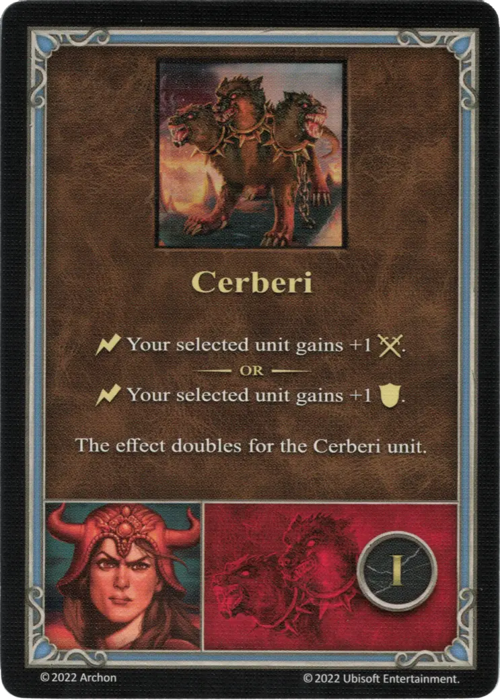

# Fiona

{ width=540 align=right }

___

[:might: Demoniac](index.md)

___

[Inferno](../towns/inferno.md)

___

[:attack:](../statistics/attack.md)&nbsp;2 [:defense:](../statistics/defense.md)&nbsp;2 [:empower:](../statistics/power.md)&nbsp;1 [:skill:](../statistics/knowledge.md)&nbsp;1

___

[Scouting](../abilities/scouting.md)

___

## Specialty

=== "Cerberi Ⅰ"

    <figure markdown="span">
        { width="340" align=right }
    </figure>

=== "Cerberi Ⅳ"

    <figure markdown="span">
        { width="340" align=right }
    </figure>

=== "Cerberi Ⅵ"

    <figure markdown="span">
        { width="340" align=right }
    </figure>

| Level | Description |
| :---: | :---: |
| Ⅰ | :instant: Your selected [unit](../units/index.md) gains +1 :attack:  — OR —  :instant: Your selected [unit](../units/index.md) gains +1 :defense:  This effect doubles for the [Cerberi unit](../units/cerberi.md). |
| Ⅳ | :ongoing: For this Combat, your selected [unit's](../units/index.md) :health_points: is increased by 1.  This effect doubles for the [Cerberi unit](../units/cerberi.md). |
| Ⅵ | :instant: Your selected [unit](../units/index.md) gains +2 :attack:  This effect doubles for the [Cerberi unit](../units/cerberi.md). |

## Comes With

- [Inferno Expansion](../content/inferno_expansion.md)

## See Also

- [List of Heroes](index.md)
- [List of Towns](../towns/index.md)

