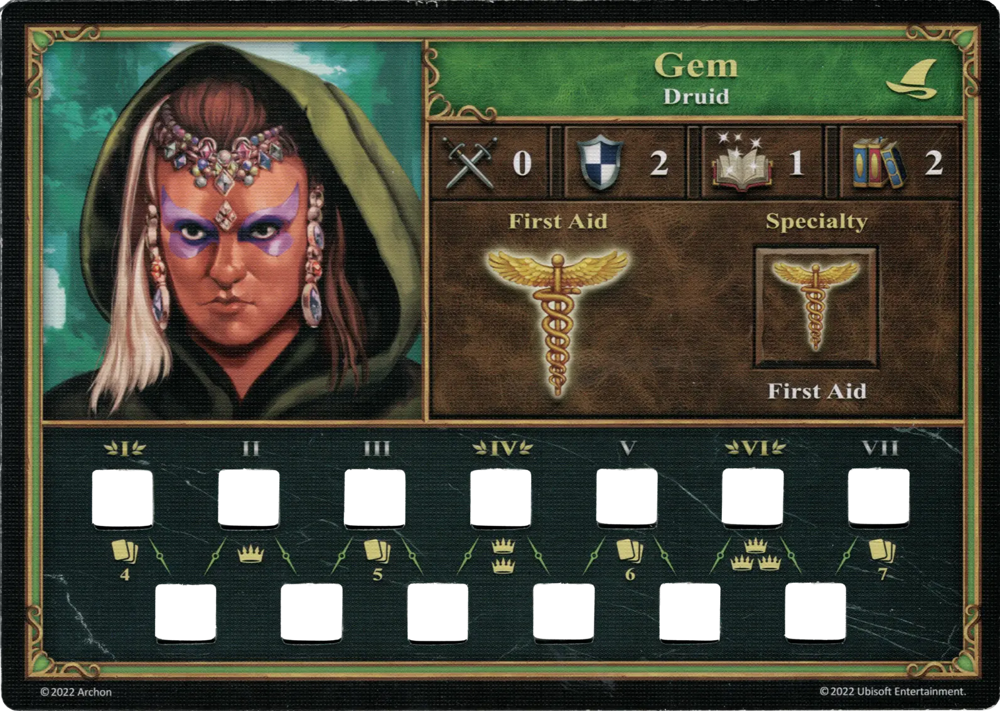
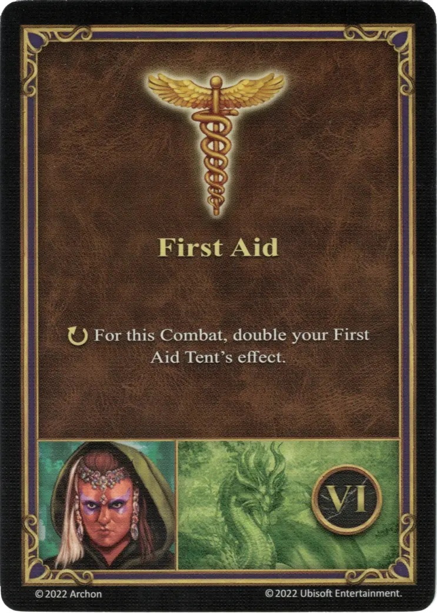

# Gem

{ width=540 align=right }

___

[:magic: Druid](index.md)

___

[Rampart](../towns/rampart.md)

___

[:attack:](../statistics/attack.md)&nbsp;0 [:defense:](../statistics/defense.md)&nbsp;2 [:empower:](../statistics/power.md)&nbsp;1 [:skill:](../statistics/knowledge.md)&nbsp;2

___

[First Aid](../abilities/first_aid.md)

___

## Specialty

=== "First Aid Ⅰ"

    <figure markdown="span">
        { width="340" align=right }
    </figure>

=== "First Aid Ⅳ"

    <figure markdown="span">
        { width="340" align=right }
    </figure>

=== "First Aid Ⅵ"

    <figure markdown="span">
        { width="340" align=right }
    </figure>

| Level | Description |
| :---: | :---: |
| Ⅰ | :instant: Take a [First Aid Tent](../war_machines/first_aid_tent.md) card from the [War Machine](../war_machines/index.md) deck at no cost.  — OR —  :instant: If you already have a [First Aid Tent](../war_machines/first_aid_tent.md), draw 1 card. |
| Ⅳ | :instant: Remove 2 :damage: from one of your [units](../units/index.md). |
| Ⅵ | :ongoing: For this Combat, double your [First Aid Tent's](../war_machines/first_aid_tent.md) effect. |

## Appearances As Player Hero

- Dead-cold Revenge - 2. Final Peace
- Dead-cold Revenge - 3. Agents Of Vengeance

## Comes With

- [Rampart Expansion](../content/rampart_expansion.md)

## See Also

- [List of Heroes](index.md)
- [List of Towns](../towns/index.md)

