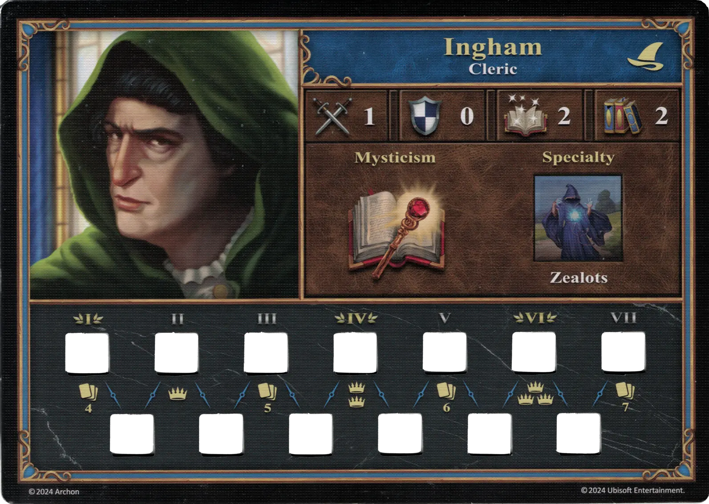
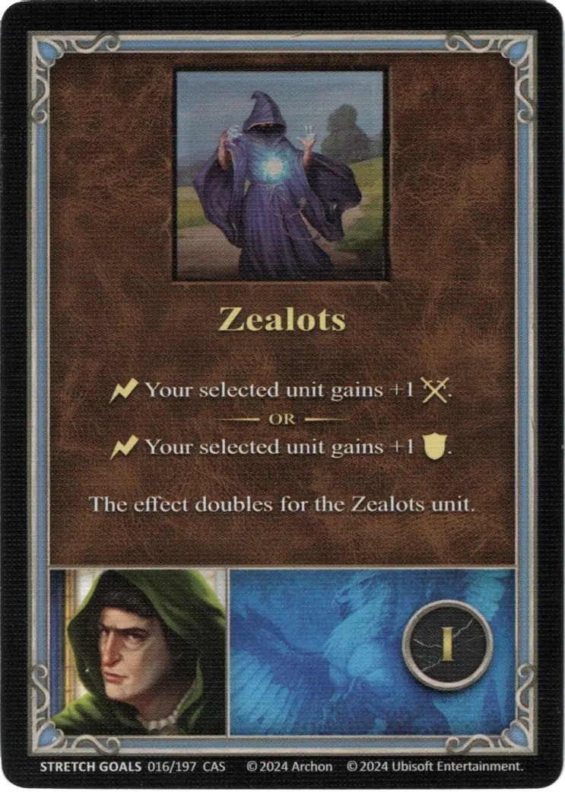
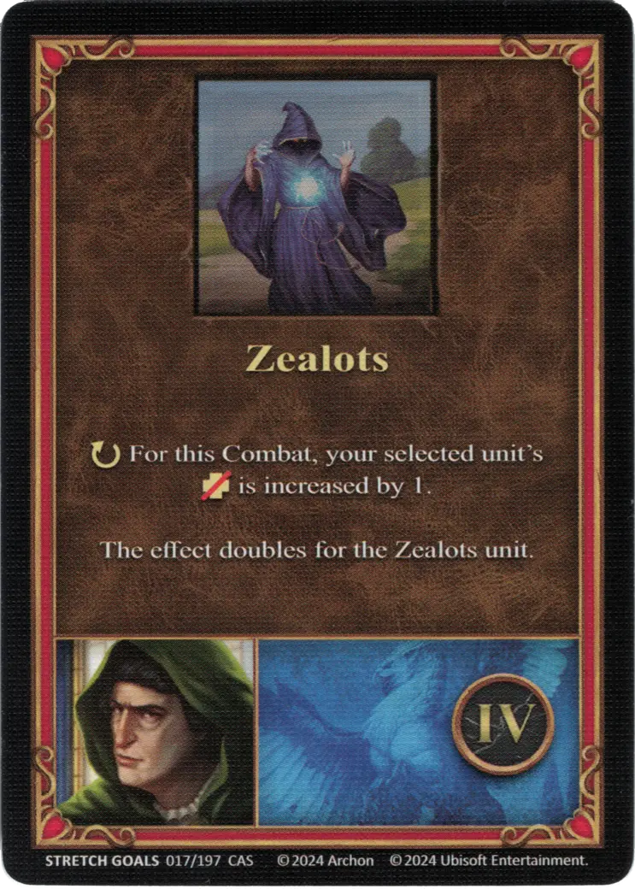
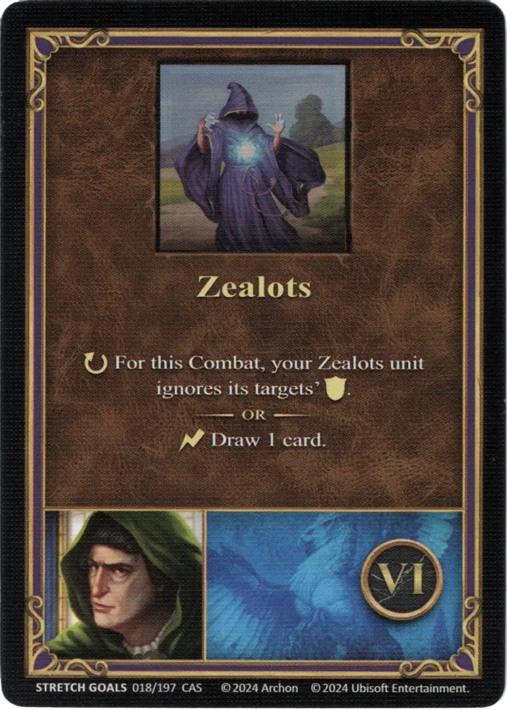

# Ingham

{ width=540 align=right }

___

[:magic: Cleric](index.md)

___

[Castle](../towns/castle.md)

___

[:attack:](../statistics/attack.md)&nbsp;1 [:defense:](../statistics/defense.md)&nbsp;0 [:power:](../statistics/power.md)&nbsp;2 [:knowledge:](../statistics/knowledge.md)&nbsp;2

___

[Mysticism](../abilities/mysticism.md)

___

## Specialty

=== "Zealots Ⅰ"

    <figure markdown="span">
        { width="340" align=right }
    </figure>

=== "Zealots Ⅳ"

    <figure markdown="span">
        { width="340" align=right }
    </figure>

=== "Zealots Ⅵ"

    <figure markdown="span">
        { width="340" align=right }
    </figure>

| Level | Description |
| :---: | :---: |
| Ⅰ | :instant: Your selected [unit](../units/index.md) gains +1 :attack:.  — OR —  :instant: Your selected [unit](../units/index.md) gains +1 :defense:.  The effect doubles for the [Zealots unit](../units/zealots.md). |
| Ⅳ | :ongoing: For this Combat, your selected [unit's](../units/index.md) :health_points: is increased by 1.  The effect doubles for the [Zealots unit](../units/zealots.md). |
| Ⅵ | :ongoing: For this Combat, your [Zealots unit](../units/zealots.md) ignores its targets' :defense:.  — OR —  :instant: Draw 1 card. |

## Comes With

- [Regular Stretch Goals 2024](../content/regular_stretch_goals.md)

## See Also

- [List of Heroes](index.md)
- [List of Towns](../towns/index.md)

