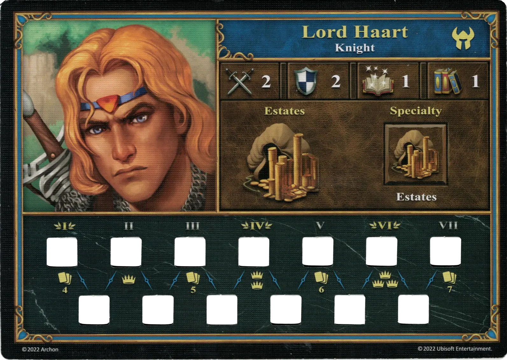
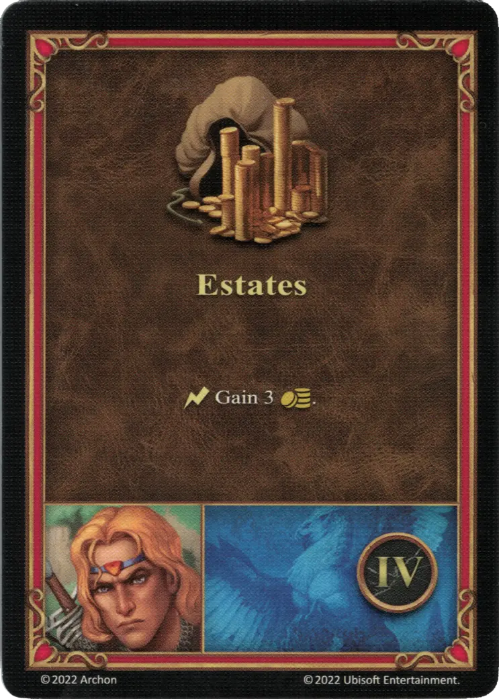

# Lord Haart (Castle)

{ width=540 align=right }

___

[:might: Knight](index.md)

___

[Castle](../towns/castle.md)

___

[:attack:](../statistics/attack.md)&nbsp;2 [:defense:](../statistics/defense.md)&nbsp;2 [:empower:](../statistics/power.md)&nbsp;1 [:skill:](../statistics/knowledge.md)&nbsp;1

___

[Estates](../abilities/estates.md)

___

## Specialty

=== "Estates Ⅰ"

    <figure markdown="span">
        { width="340" align=right }
    </figure>

=== "Estates Ⅳ"

    <figure markdown="span">
        { width="340" align=right }
    </figure>

=== "Estates Ⅵ"

    <figure markdown="span">
        { width="340" align=right }
    </figure>

| Level | Description |
| :---: | :---: |
| Ⅰ | :instant: Gain 2 :gold:. |
| Ⅳ | :instant: Gain 3 :gold:. |
| Ⅵ | :instant: Gain 5 :gold:. |

## Comes With

- [Tower Expansion](../content/tower_expansion.md)

## See Also

- [Lord Haart (Necropolis)](lord_haart_necropolis.md)
- [List of Heroes](index.md)
- [List of Towns](../towns/index.md)

