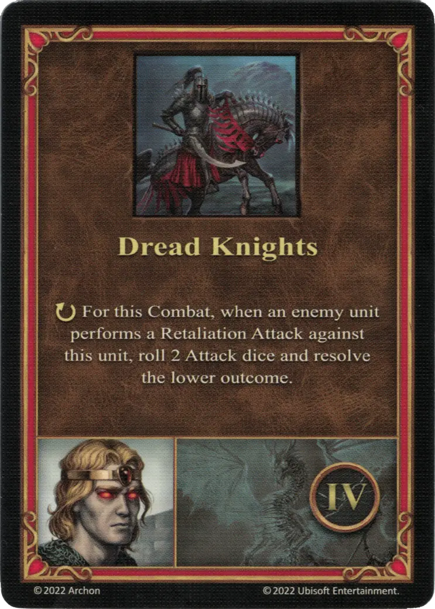

# Lord Haart (Necropolis)

{ width=540 align=right }

___

[:might: Death Knight](index.md)

___

[Necropolis](../towns/necropolis.md)

___

[:attack:](../statistics/attack.md)&nbsp;1 [:defense:](../statistics/defense.md)&nbsp;2 [:power:](../statistics/power.md)&nbsp;2 [:knowledge:](../statistics/knowledge.md)&nbsp;1

___

[Necromancy](../abilities/necromancy.md)

___

## Specialty

=== "Dread Knights Ⅰ"

    <figure markdown="span">
        { width="340" align=right }
    </figure>

=== "Dread Knights Ⅳ"

    <figure markdown="span">
        { width="340" align=right }
    </figure>

=== "Dread Knights Ⅵ"

    <figure markdown="span">
        { width="340" align=right }
    </figure>

| Level | Description |
| :---: | :---: |
| Ⅰ | :instant: Reduce the :damage: from enemy retaliation by 1.  This effect doubles for the [Dread Knights unit](../units/dread_knights.md). |
| Ⅳ | :ongoing: For this Combat, when an enemy performs a Retaliation Attack against this [unit](../units/index.md), roll 2 [Attack dice](../keywords/dice.md#attack-die) and resolve the lower outcome. |
| Ⅵ | :instant: Reduce the :damage: from enemy retaliation by 2.  This effect doubles for the [Dread Knights unit](../units/dread_knights.md). |

## Appearances As Enemy Hero

- Playing With Fire - 3. Burning Of Tatalia

## Comes With

- [Tower Expansion](../content/tower_expansion.md)

## See Also

- [Lord Haart (Castle)](lord_haart_castle.md)
- [List of Heroes](index.md)
- [List of Towns](../towns/index.md)

