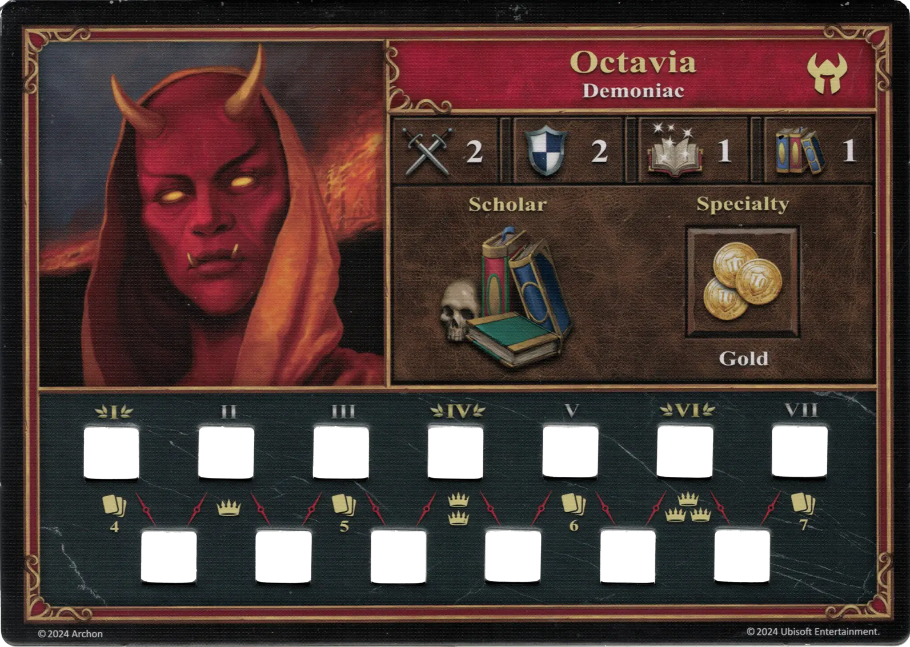
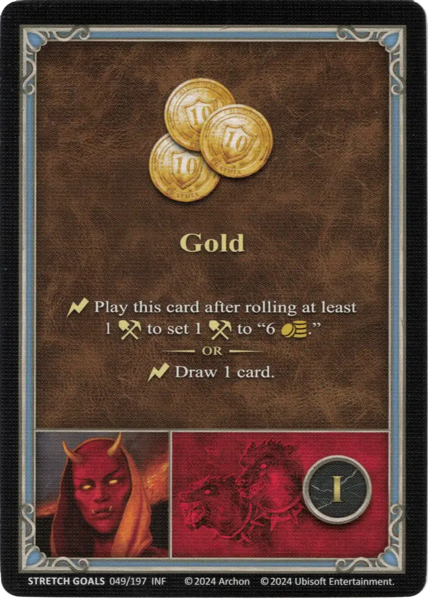
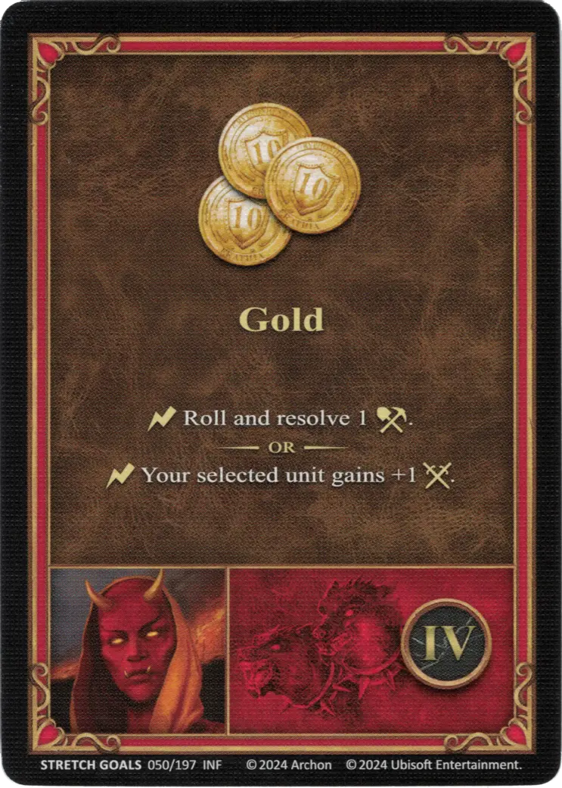
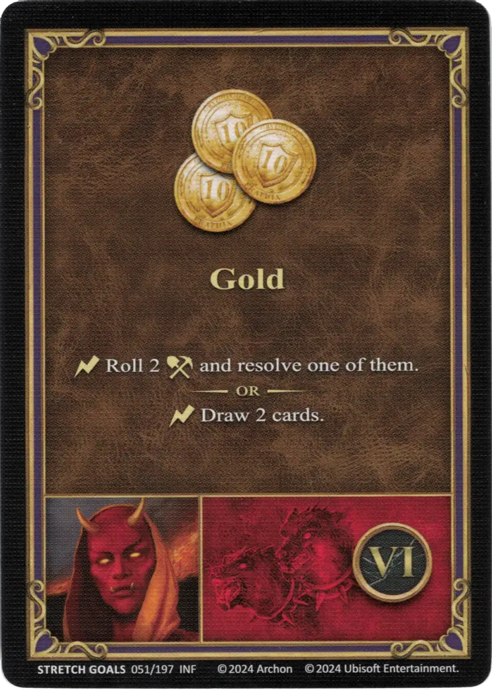

# Octavia

{ width=540 align=right }

___

[:might: Demoniac](index.md)

___

[Inferno](../towns/inferno.md)

___

[:attack:](../statistics/attack.md)&nbsp;2 [:defense:](../statistics/defense.md)&nbsp;2 [:power:](../statistics/power.md)&nbsp;1 [:knowledge:](../statistics/knowledge.md)&nbsp;1

___

[Scholar](../abilities/scholar.md)

___

## Specialty

=== "Gold Ⅰ"

    <figure markdown="span">
        { width="340" align=right }
    </figure>

=== "Gold Ⅳ"

    <figure markdown="span">
        { width="340" align=right }
    </figure>

=== "Gold Ⅵ"

    <figure markdown="span">
        { width="340" align=right }
    </figure>

| Level | Description |
| :---: | :---: |
| Ⅰ | :instant: Play this card after rolling at least 1 [:resource_die:](../keywords/dice.md) to set 1 [:resource_die:](../keywords/dice.md) to "6 :gold:".  — OR —  :instant: Draw 1 card. |
| Ⅳ | :instant: Roll and resolve 1 [:resource_die:](../keywords/dice.md).  — OR —  :instant: Your selected [unit](../units/index.md) gains +1 :attack:. |
| Ⅵ | :instant: Roll 2 [:resource_die:](../keywords/dice.md) and resolve one of them.  — OR —  :instant: Draw 2 cards. |

## Comes With

- [Regular Stretch Goals 2024](../content/regular_stretch_goals.md)

## See Also

- [List of Heroes](index.md)
- [List of Towns](../towns/index.md)

