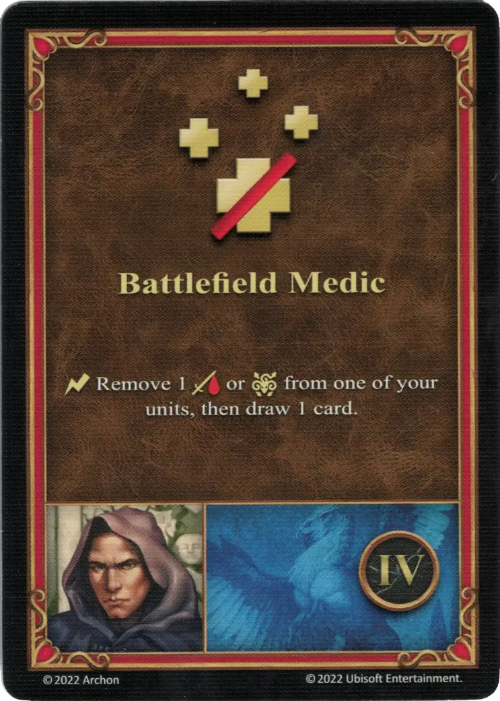

# Rion

{ width=540 align=right }

___

[:magic: Cleric](index.md)

___

[Castle](../towns/castle.md)

___

[:attack:](../statistics/attack.md)&nbsp;1 [:defense:](../statistics/defense.md)&nbsp;0 [:empower:](../statistics/power.md)&nbsp;2 [:skill:](../statistics/knowledge.md)&nbsp;2

___

[Wisdom](../abilities/wisdom.md)

___

## Specialty

=== "Battlefield Medic Ⅰ"

    <figure markdown="span">
        { width="340" align=right }
    </figure>

=== "Battlefield Medic Ⅳ"

    <figure markdown="span">
        { width="340" align=right }
    </figure>

=== "Battlefield Medic Ⅵ"

    <figure markdown="span">
        { width="340" align=right }
    </figure>

| Level | Description |
| :---: | :---: |
| Ⅰ | :instant: Remove 1 :damage: from one of your [units](../units/index.md), then draw 1 card. |
| Ⅳ | :instant: Remove 1 :damage: or :paralysis: from one of your [units](../units/index.md), then draw 1 card. |
| Ⅵ | :instant: Remove up to 2 :damage: or :paralysis: from one of your [units](../units/index.md), then draw 2 cards and discard 1 card from your hand. |

## Appearances As Player Hero

- Long Live The Queen - 2. Guardian Angels
- Long Live The Queen - 3. Steadwick's Liberation

## Comes With

- [Core Game](../content/core_game.md)

## See Also

- [List of Heroes](index.md)
- [List of Towns](../towns/index.md)

