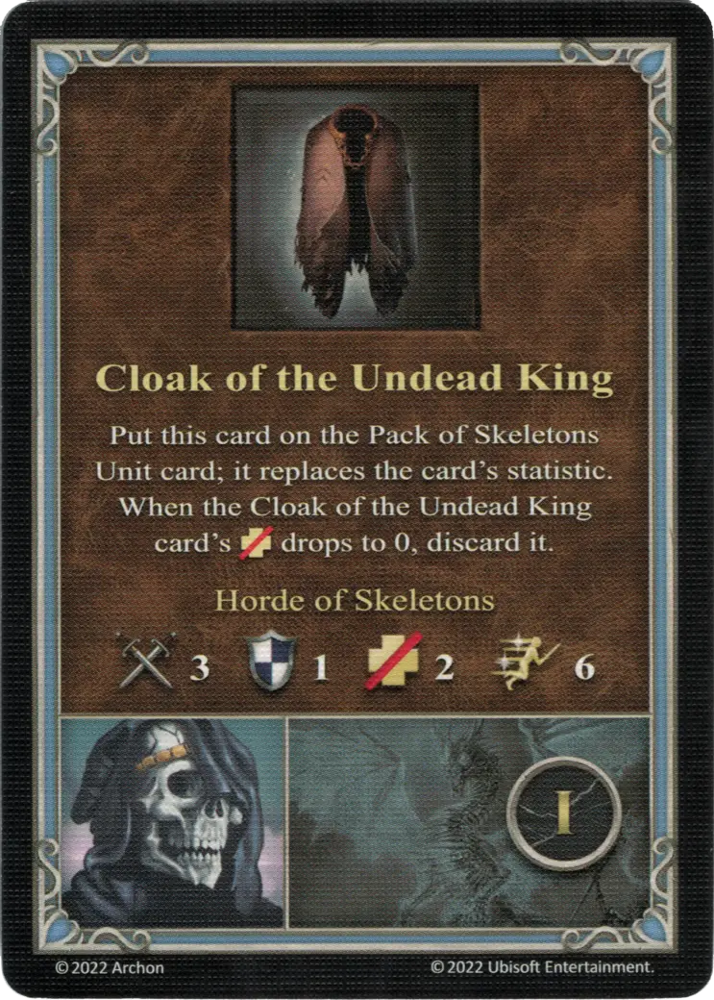

# Sandro

___

[:magic: Necromancer](index.md)

___

[Necropolis](../towns/necropolis.md)

___

| [:attack:](../statistics/attack.md) | [:defense:](../statistics/defense.md) | [:empower:](../statistics/power.md) | [:skill:](../statistics/knowledge.md) | [Ability](../abilities/index.md) | Specialty |
| :---: | :---: | :---: | :---: | :--- | :--- |
| 1 | 0 | 2 | 2 | [Sorcery](../abilities/sorcery.md) | [Cloak of the Undead King](#specialty) |

___

## Specialty

=== "Cloak of the Undead King Ⅰ"

    <figure markdown="span">
        { width="340" align=right }
    </figure>

=== "Cloak of the Undead King Ⅳ"

    <figure markdown="span">
        { width="340" align=right }
    </figure>

=== "Cloak of the Undead King Ⅵ"

    <figure markdown="span">
        { width="340" align=right }
    </figure>

| Level | Descrition |
| :---: | :---: |
| Ⅰ | Put this card on the [Pack of Skeletons Unit](../units/skeletons.md) card; it replaces the card's statistic. When the Cloak of the Undead King card's :health_points: drops to 0. When it does, discard this card.  **Horde of Skeletons** :attack: 3 :defense: 1 :health_points: 2 :initiative: 6 |
| Ⅳ | Put this card on the [Pack of Zombies Unit](../units/zombies.md) card; it replaces the card's statistic. When the Cloak of the Undead King card's :health_points: drops to 0. When it does, discard this card.  **Horde of Zombies** :attack: 4 :defense: 1 :health_points: 3 :initiative: 5 |
| Ⅵ | Put this card on the [Skeletons Unit](../units/skeletons.md) card; it replaces the card's statistic. When the Cloak of the Undead King card's :health_points: drops to 0. When it does, discard this card.  **Legion of Skeletons** :attack: 4 :defense: 1 :health_points: 2 :initiative: 6 |

## Notes

- Cloak of the Undead King Ⅰ and Ⅳ - this can only be played on a pack of Skeletons or Zombies, adding another amount to them, named "Horde".
- Cloak of the Undead King Ⅳ - the abilities of the Pack of Zombies become inactive if they are upgraded to a "Horde". Once the "Horde" is defeated and they become a "Pack" again, their abilities function as usual.
- Cloak of the Undead King Ⅵ - any amount of Skeletons may be upgraded to a "Legion". If the Skeletons are upgraded to a "Legion", they may be further upgraded to a "Pack" or a "Horde", but the "Legion" stays on top and its statistics are applied until defeated.

## Comes With

- [Core Game](../content.md)

## See Also

- [List of Heroes](index.md)
- [List of Towns](../towns/index.md)
