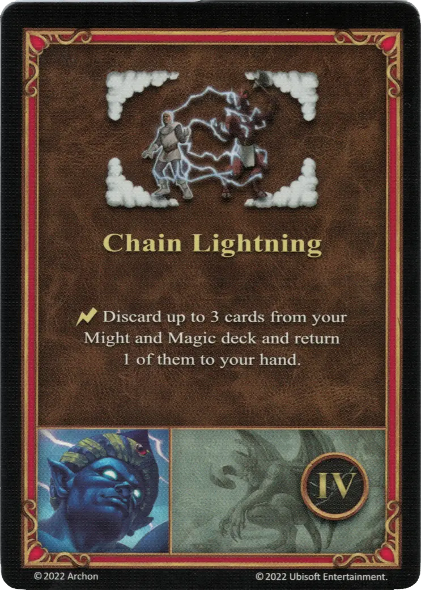
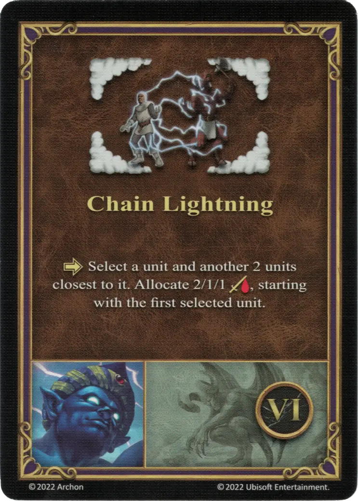

# Solmyr

___

[:magic: Wizard](index.md)

___

[Tower](../towns/tower.md)

___

| [:attack:](../statistics/attack.md) | [:defense:](../statistics/defense.md) | [:empower:](../statistics/power.md) | [:skill:](../statistics/knowledge.md) | [Ability](../abilities/index.md) | Specialty |
| :---: | :---: | :---: | :---: | :--- | :--- |
| 0 | 0 | 2 | 3 | [Sorcery](../abilities/sorcery.md) | [Chain Lightning](#specialty) |

___

## Specialty

=== "Chain Lightning Ⅰ"

    <figure markdown="span">
        { width="340" align=right }
    </figure>

=== "Chain Lightning Ⅳ"

    <figure markdown="span">
        { width="340" align=right }
    </figure>

=== "Chain Lightning Ⅵ"

    <figure markdown="span">
        { width="340" align=right }
    </figure>

| Level | Description |
| :---: | :---: |
| Ⅰ | :activation: Select a [unit](../units/index.md) and another 2 [units](../units/index.md) closest to it. Allocate 1/1/0 :damage:. starting with the first selected [unit](../units/index.md). |
| Ⅳ | :instant: Discard up to 3 cards from your Might and Magic deck and return 1 of them to your hand. |
| Ⅵ | :activation: Select a [unit](../units/index.md) and another 2 [units](../units/index.md) closest to it. Allocate 2/1/1 :damage:. starting with the first selected [unit](../units/index.md). |

## Comes With

- [Tower Expansion](../content.md)

## See Also

- [List of Heroes](index.md)
- [List of Towns](../towns/index.md)
