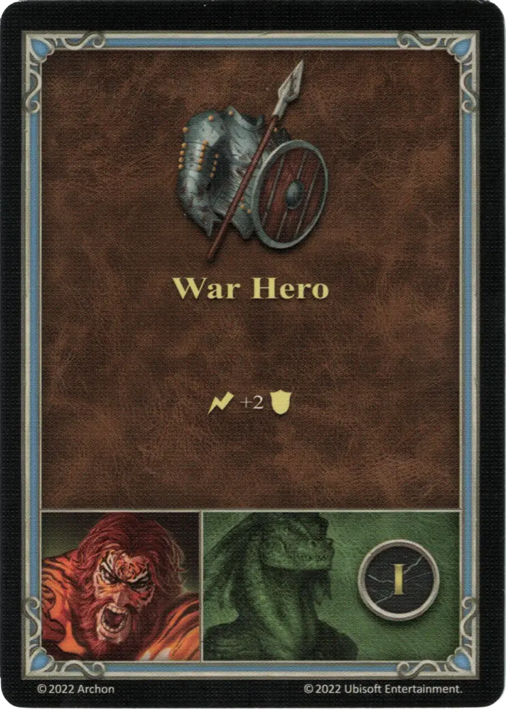

# Tazar

{ width=540 align=right }

___

[:might: Beastmaster](index.md)

___

[Fortress](../towns/fortress.md)

___

[:attack:](../statistics/attack.md)&nbsp;0 [:defense:](../statistics/defense.md)&nbsp;4 [:empower:](../statistics/power.md)&nbsp;1 [:skill:](../statistics/knowledge.md)&nbsp;1

___

[Armorer](../abilities/armorer.md)

___

## Specialty

=== "War Hero Ⅰ"

    <figure markdown="span">
        { width="340" align=right }
    </figure>

=== "War Hero Ⅳ"

    <figure markdown="span">
        { width="340" align=right }
    </figure>

=== "War Hero Ⅵ"

    <figure markdown="span">
        { width="340" align=right }
    </figure>

| Level | Description |
| :---: | :---: |
| Ⅰ | :instant: +2 :defense: |
| Ⅳ | :ongoing: For this Combat, your selected [unit](../units/index.md) gains +1 :defense:. |
| Ⅵ | :effect_map: From your hand, Remove 1 card or Discard 3 cards to draw an [Artifact](../artifacts/index.md) card from the top of the [Artifact](../artifacts/index.md) deck. |

## Notes

- **Ⅵ** - The player either removes any 1 card from their hand or they discard 3 cards. In either case, they get to draw the top card of the [Artifact](../artifacts/index.md) deck.

## Comes With

- [Tower Expansion](../content/tower_expansion.md)

## See Also

- [List of Heroes](index.md)
- [List of Towns](../towns/index.md)

