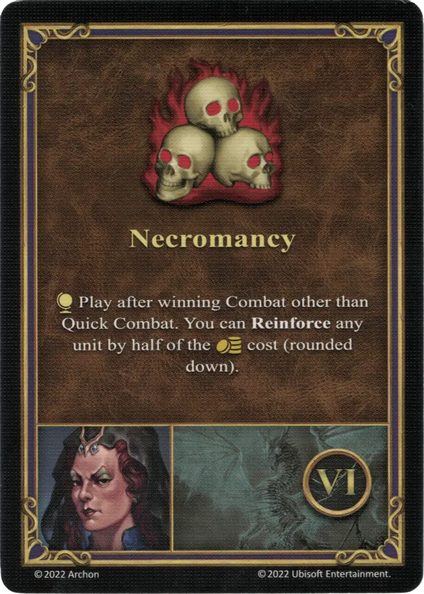

# Vidomina

{ width=540 align=right }

___

[:magic: Necromancer](index.md)

___

[Necropolis](../towns/necropolis.md)

___

[:attack:](../statistics/attack.md)&nbsp;1 [:defense:](../statistics/defense.md)&nbsp;0 [:power:](../statistics/power.md)&nbsp;2 [:knowledge:](../statistics/knowledge.md)&nbsp;2

___

[Necromancy](../abilities/necromancy.md)

___

## Specialty

=== "Necromancy Ⅰ"

    <figure markdown="span">
        { width="340" align=right }
    </figure>

=== "Necromancy Ⅳ"

    <figure markdown="span">
        { width="340" align=right }
    </figure>

=== "Necromancy Ⅵ"

    <figure markdown="span">
        { width="340" align=right }
    </figure>

| Level | Description |
| :---: | :---: |
| Ⅰ | :map_effect: Play after winning Combat other than Quick Combat. You can **Reinforce** a :bronze: or :silver: [unit](../units/index.md) of your choice for half the :gold: cost (rounded down). |
| Ⅳ | :instant: Put this card on the ["Pack" of Skeletons Unit](../units/skeletons.md) card; it replaces the card's statistic. Keep the card, until the card's :health_points: drops to 0. When it does, discard this card.  **Horde of Skeletons** :attack: 3 :defense: 1 :health_points: 2 :initiative: 6 |
| Ⅵ | :map_effect: Play after winning Combat other than Quick Combat. You can **Reinforce** any [unit](../units/index.md) of your choice for half the :gold: cost (rounded down). |

## Appearances As Enemy Hero

- Dead-cold Revenge - 3. Agents Of Vengeance

## Comes With

- [Tower Expansion](../content/tower_expansion.md)

## See Also

- [List of Heroes](index.md)
- [List of Towns](../towns/index.md)

