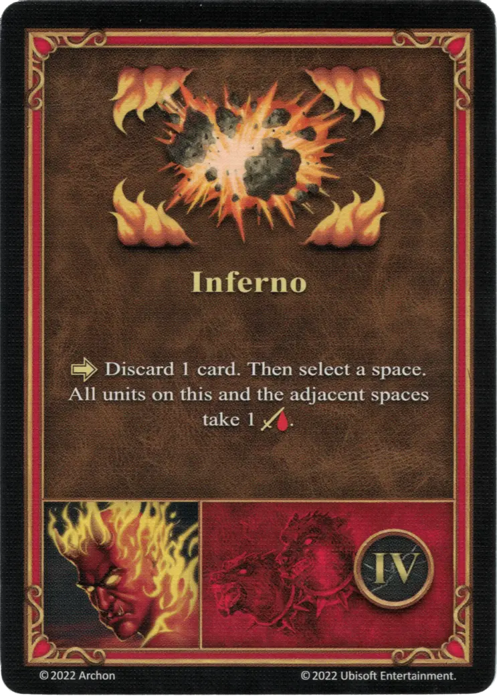

# Xyron

{ width=540 align=right }

___

[:magic: Heretic](index.md)

___

[Inferno](../towns/inferno.md)

___

[:attack:](../statistics/attack.md)&nbsp;1 [:defense:](../statistics/defense.md)&nbsp;1 [:power:](../statistics/power.md)&nbsp;2 [:knowledge:](../statistics/knowledge.md)&nbsp;1

___

[Wisdom](../abilities/wisdom.md)

___

## Specialty

=== "Inferno Ⅰ"

    <figure markdown="span">
        { width="340" align=right }
    </figure>

=== "Inferno Ⅳ"

    <figure markdown="span">
        { width="340" align=right }
    </figure>

=== "Inferno Ⅵ"

    <figure markdown="span">
        { width="340" align=right }
    </figure>

| Level | Description |
| :---: | :---: |
| Ⅰ | :activation: Discard 2 cards. Then select a space. All [units](../units/index.md) on this and the adjacent spaces take 1 :damage:. |
| Ⅳ | :activation: Discard 1 card. Then select a space. All [units](../units/index.md) on this and the adjacent spaces take 1 :damage:. |
| Ⅵ | :activation: Select a space. All [units](../units/index.md) on this and the adjacent spaces take 1 :damage:. |

## Notes

- The :damage: from Inferno also applies to friendly units.

## Comes With

- [Inferno Expansion](../content/inferno_expansion.md)

## See Also

- [List of Heroes](index.md)
- [List of Towns](../towns/index.md)

