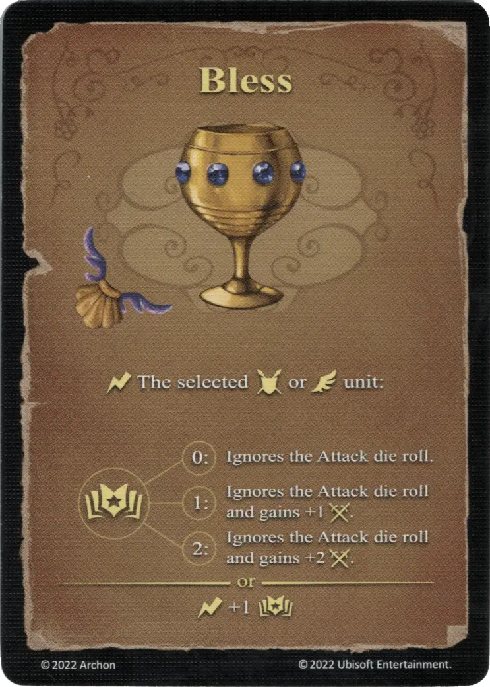

# Bless

{ width="340" align=right }

___

[Water School of Magic](school_of_water_magic.md)

___

:instant: The selected :unit_ground: or :unit_flying: unit:  :empower: 0 - Ignores the [Attack die](../dice.md#attack-die) roll. :empower: 1 - Ignores the [Attack die](../dice.md#attack-die) roll and gains +1 :attack: :empower: 2 - Ignores the [Attack die](../dice.md#attack-die) roll and gains +2 :attack:

___

## Comes With

- [Core Game](../content.md)

## See Also

- [List of Spells](../spells.md)
- [School of Water Magic](school_of_water_magic.md)
