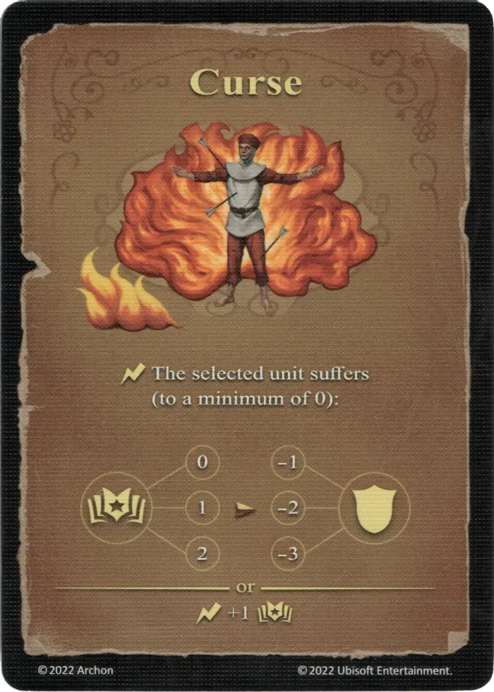

# Curse

{ width="340" align=right }

___

[Basic Fire Spell](index.md#school-of-fire-magic)

___

:instant: The selected [unit](../units/index.md) suffers (to a minimum of 0):  :power: 0 ➣ -1 :defense: :power: 1 ➣ -2 :defense: :power: 2 ➣ -3 :defense:  — OR —  :instant: +1 :power:

___

## Comes With

- [Core Game](../content/core_game.md)

## See Also

- [School of Fire Magic](index.md#school-of-fire-magic)
- [List of Spells](index.md)
