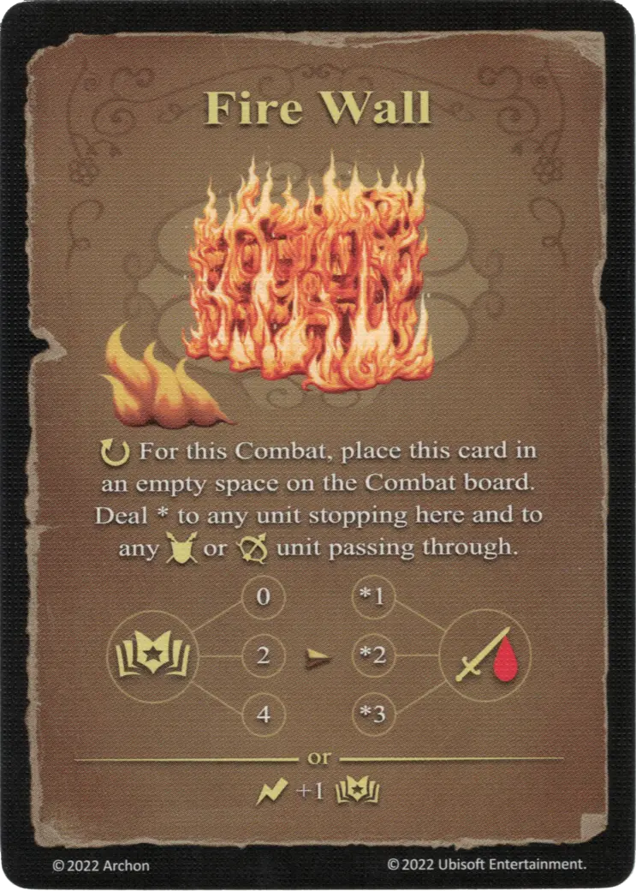

# Fire Wall

{ width="340" align=right }

___

[Basic Fire Spell](index.md#school-of-fire-magic)

___

:ongoing: For this Combat, place this card in an empty space on the Combat board. Deal \* to any [unit](../units/index.md) stopping here and to any :ground_unit: or :ranged_unit: [unit](../units/index.md) passing through.  :power: 0 ➣ \*1 :damage: :power: 2 ➣ \*2 :damage: :power: 4 ➣ \*3 :damage:  — OR —  :instant: +1 :power:

___

## Notes

- [^1] On the large battlefield, a Fire Wall token is placed onto the battlefield instead of the card.

## Comes With

- [Rampart Expansion](../content/rampart_expansion.md)

## See Also

- [School of Fire Magic](index.md#school-of-fire-magic)
- [List of Spells](index.md)

[^1]: Exceptions for specific game modes. This explanation is not valid for all game modes. The specific variant for the game mode is mentioned in the text.
