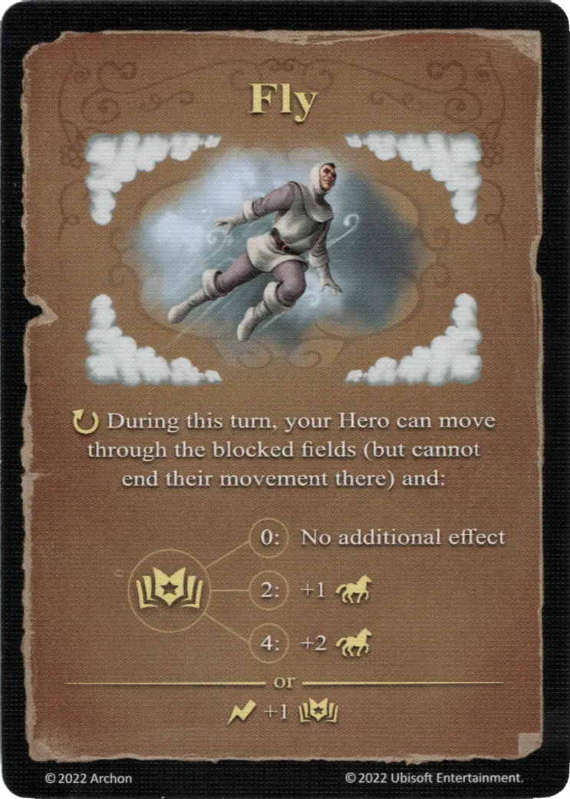

# Fly

{ width="340" align=right }

___

[Expert Air Spell](school_of_air_magic.md)

___

:ongoing: During this turn, your [Hero](../heroes/index.md) can move through the blocked fields (but cannot end their movement there) and:  :empower: 0 ➣ No additional effect :empower: 2 ➣ +1 :movement: :empower: 4 ➣ +2 :movement:  — OR —  :instant: +1 :empower:

___

## Comes With

- [Fortress Expansion](../content/fortress_expansion.md)

## See Also

- [School of Air Magic](school_of_air_magic.md)
- [List of Spells](index.md)
