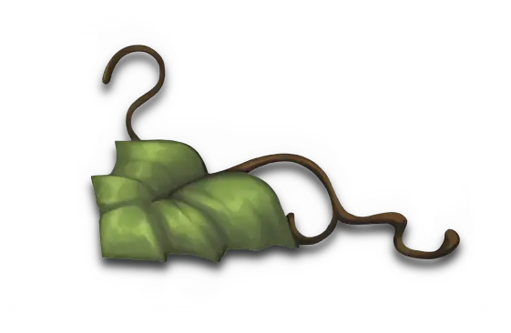
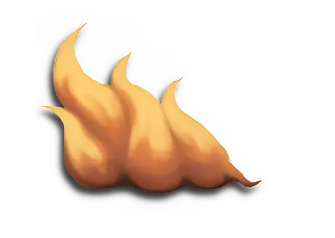
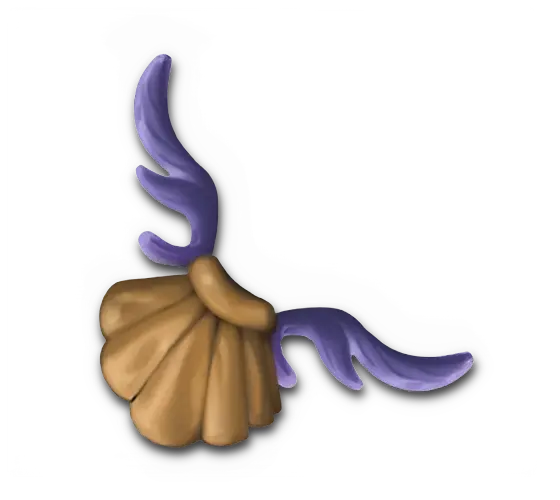

# Spells

Also shown as :spell:.

Each spell has an effect that can be improved upon by [**Empowering**](../keywords/empower.md) (:power:) it.
This makes the effect of the spell stronger, at the expense of using extra cards to do so.
In addition to their regular effects, any spell can also be discarded to provide +1 :power:.
Spells are gained by [**Searching**](../keywords/search.md) the Spell deck, either the [Mage Guild](../towns/index.md#buildings), by visiting [fields](../fields/index.md) or by any other effect that lets the player do the [**Search**](../keywords/search.md).

## Levels

### Basic Spells

Basic Spell Cards have the symbol of their [School](index.md#schools) in one of its corners.

### Expert Spells

Expert Spell Cards have the symbol of their [School](index.md#schools) in all of its corners.

## Schools

All Spell Cards belong to one School: Air, Earth, Fire, or Water.
The sole exception to this rule is the [Magic Arrow](magic_arrow.md) spell, which can belong to any School (its School needs to be chosen at the time of casting it).
[Hero specialties](../heroes/index.md) are not considered Spells, even though some of them have a School of Magic.

### School of Air Magic

<figure markdown="span">

{ width=200 align=left }

</figure>

| Name | Level | Effect | Content |
| :--- | :---: | :---: | :--- |
| [Air Shield](air_shield.md) | Basic | :ongoing: Until the end of the Combat, the selected [unit](../units/index.md) gains \* when it is attacked by a [:ranged_unit: unit](../units/index.md#ranged-units).  :power: 0 ➣ +1 :defense: :power: 1 ➣ +2 :defense: :power: 2 ➣ +3 :defense: | [Regular Stretch Goals 2024](../content/regular_stretch_goals.md) |
| [Chain Lightning](chain_lightning.md) | Expert | :activation: Select a [unit](../units/index.md) and another 2 [units](../units/index.md) closest to it. Allocate \* :damage:, starting with the first selected [unit](../units/index.md).  :power: 0 ➣ 1/1/1 :damage: :power: 2 ➣ 2/1/1 :damage: :power: 4 ➣ 3/2/1 :damage: | [Core Game](../content/core_game.md) |
| [Counterstrike](counterstrike.md) | Expert | :instant: Remove the Black cube from the selected \* [Unit](../units/index.md) card - that [unit](../units/index.md) is now able to perform a Retaliation Attack action again:  :power: 0 ➣ \*:bronze_tier: :power: 2 ➣ \*:bronze_tier: or :silver_tier: :power: 4 ➣ \*:bronze_tier: or :silver_tier: or :gold_tier: | [Core Game](../content/core_game.md) |
| [Dimension Door](dimension_door.md) | Expert | :map_effect: Move a [Hero](../heroes/index.md) up to \* field(s). Ignore any obstacles and fields in-between and resolve the last one normally.  :power: 0 ➣ \*1 :power: 2 ➣ \*2 :power: 4 ➣ \*3 | [Rampart Expansion](../content/rampart_expansion.md) |
| [Disrupting Ray](disrupting_ray.md) | Basic | :ongoing: Until the end of the Combat, the selected \* [unit](../units/index.md) cannot use their special ability:  :power: 0 ➣ \*:bronze_tier: :power: 1 ➣ \*:bronze_tier: or :silver_tier: :power: 2 ➣ \*:bronze_tier: or :silver_tier: or :gold_tier: | [Core Game](../content/core_game.md) |
| [Fly](fly.md) | Expert | :ongoing: During this turn, your [Hero](../heroes/index.md) can move through the blocked fields (but cannot end their movement there) and:  :power: 0 ➣ No additional effect :power: 2 ➣ +1 :movement_points: :power: 4 ➣ +2 :movement_points: | [Fortress Expansion](../content/fortress_expansion.md) |
| [Fortune](fortune.md) | Basic | :instant: Reroll one [Treasure](../keywords/dice.md#treasure-die), [Resource](../keywords/dice.md#resource-die), or [Attack die](../keywords/dice.md#attack-die) \*. Resolve the result of your choice  :power: 0 ➣ \*once :power: 1 ➣ \*twice :power: 2 ➣ \*3 times | [Fortress Expansion](../content/fortress_expansion.md) |
| [Haste](haste.md) | Basic | :ongoing: Until the end of the Combat, the selected [unit](../units/index.md) gains:  :power: 0 ➣ +1 :initiative: :power: 1 ➣ +2 :initiative: :power: 2 ➣ +3 :initiative: | [Core Game](../content/core_game.md) |
| [Lightning Bolt](lightning_bolt.md) | Basic | :activation: The selected [unit](../units/index.md) suffers:  :power: 0 ➣ 2 :damage: :power: 1 ➣ 3 :damage: :power: 2 ➣ 4 :damage: | [Core Game](../content/core_game.md) |
| [Magic Arrow](magic_arrow.md) | Basic | :activation: The selected [unit](../units/index.md) suffers:  :power: 0 ➣ 1 :damage: :power: 1 ➣ 2 :damage: :power: 2 ➣ 3 :damage: | [Core Game](../content/core_game.md) [Rampart Expansion](../content/rampart_expansion.md) [Fortress Expansion](../content/fortress_expansion.md) [Inferno Expansion](../content/inferno_expansion.md) [Stronghold Expansion](../content/stronghold_expansion.md) [Conflux Expansion](../content/conflux_expansion.md) [Cove Expansion](../content/cove_expansion.md) [Regular Stretch Goals 2024](../content/regular_stretch_goals.md) (Alternate Heroes 2 art) |
| [Magic Mirror](magic_mirror.md) | Expert | :instant: When your \* [unit](../units/index.md) is about to be targeted or damaged by a [:spell:](../spells/index.md), choose a new target for that [:spell:](../spells/index.md).  :power: 0 ➣ \*:bronze_tier: :power: 1 ➣ \*:bronze_tier: or :silver_tier: :power: 2 ➣ \*:bronze_tier: or :silver_tier: or :gold_tier: | [Stronghold Expansion](../content/stronghold_expansion.md) |
| [Precision](precision.md) | Basic | :instant: When attacking a non-adjacent [unit](../units/index.md), the selected :ranged_unit: [unit](../units/index.md) ignores the combat penalties and gains:  :power: 0 ➣ +1 :attack: :power: 1 ➣ +2 :attack: :power: 2 ➣ +3 :attack: | [Rampart Expansion](../content/rampart_expansion.md) |
| [Protection from Air](protection_from_air.md) | Basic | :instant: Play this card after \* from the [School of Air Magic](index.md#school-of-air-magic) is cast to ignore that [spell's](index.md) effect.  :power: 0 ➣ \*a [Basic Spell](index.md#basic-spells) :power: 1 ➣ \*a [Basic](index.md#basic-spells) or an [Expert Spell](index.md#expert-spells) | [Regular Stretch Goals 2024](../content/regular_stretch_goals.md) |
| [Summon Air Elemental](summon_air_elemental.md) | Expert | :activation: On a chosen empty space:  :power: 0 ➣ No effect :power: 2 ➣ [**Summon**](../keywords/summon.md) a [Few Air Elementals](../units/air_elementals.md) :power: 4 ➣ [**Summon**](../keywords/summon.md) a [Pack of Air Elementals](../units/air_elementals.md) | [Conflux Expansion](../content/conflux_expansion.md) |
| [View Air](view_air.md) | Basic | :map_effect: Gain:  :power: 0 ➣ 3 :gold: :power: 1 ➣ 2 :building_materials: :power: 2 ➣ 1 :valuables: | [Tower Expansion](../content/tower_expansion.md) |

### School of Earth Magic

<figure markdown="span">

{ width=200 align=left }

</figure>

| Name | Level | Effect | Content |
| :--- | :---: | :---: | :--- |
| [Anti-Magic](anti-magic.md) | Basic | :ongoing: Until the end of the Combat, the selected \* [unit](../units/index.md) cannot be targeted by spells:  :power: 0 ➣ \*:bronze_tier: :power: 2 ➣ \*:bronze_tier: or :silver_tier: :power: 4 ➣ \*:bronze_tier: or :silver_tier: or :gold_tier: | [Core Game](../content/core_game.md) |
| [Earthquake](earthquake.md) | Basic | :instant: During a [Town](../towns/index.md) siege:  :power: 0 ➣ Remove 1 Gate or Wall obstacle of your choice. :power: 1 ➣ Remove 2 Gate or Wall obstacles of your choice. :power: 2 ➣ Every [unit](../units/index.md) adjacent to a Wall or Gate obstacle suffers 1 :damage:. Remove all Gate or Wall obstacles. | [Rampart Expansion](../content/rampart_expansion.md) |
| [Force Field](force_field.md) | Basic | :ongoing: Place this card or a Force Field token on an empty space. It counts as an Obstacle until the end of:  :power: 0 ➣ This Combat round :power: 1 ➣ The next Combat round :power: 2 ➣ This Combat | [Regular Stretch Goals 2024](../content/regular_stretch_goals.md) |
| [Implosion](implosion.md) | Expert | :activation: The selected [unit](../units/index.md) suffers:  :power: 1 ➣ 2 :damage: :power: 3 ➣ 4 :damage: :power: 5 ➣ 6:damage: | [Fortress Expansion](../content/fortress_expansion.md) |
| [Magic Arrow](magic_arrow.md) | Basic | :activation: The selected [unit](../units/index.md) suffers:  :power: 0 ➣ 1 :damage: :power: 1 ➣ 2 :damage: :power: 2 ➣ 3 :damage: | [Core Game](../content/core_game.md) [Rampart Expansion](../content/rampart_expansion.md) [Fortress Expansion](../content/fortress_expansion.md) [Inferno Expansion](../content/inferno_expansion.md) [Stronghold Expansion](../content/stronghold_expansion.md) [Conflux Expansion](../content/conflux_expansion.md) [Cove Expansion](../content/cove_expansion.md) [Regular Stretch Goals 2024](../content/regular_stretch_goals.md) (Alternate Heroes 2 art) |
| [Protection from Earth](protection_from_earth.md) | Basic | :instant: Play this card after \* from the [School of Earth Magic](index.md#school-of-earth-magic) is cast to ignore that [spell's](index.md) effect.  :power: 0 ➣ \*a [Basic Spell](index.md#basic-spells) :power: 1 ➣ \*a [Basic](index.md#basic-spells) or an [Expert Spell](index.md#expert-spells) | [Regular Stretch Goals 2024](../content/regular_stretch_goals.md) |
| [Quicksand](quicksand.md) | Basic | :ongoing: Shuffle up to \* Quicksand tokens and place them face down on chosen empty spaces. Once placed, you can look at your tokens (See [Stronghold](../content/stronghold_expansion.md) rulebook).  :power: 0 ➣ 2 :power: 1 ➣ 4 :power: 2 ➣ 6 | [Stronghold Expansion](../content/stronghold_expansion.md) |
| [Resurrection](resurrection.md) | Expert | :instant: Cancel an attack that would reduce your \* [unit's](../units/index.md) :health_points: to 0. You can cast this spell immediately after the enemy [unit's](../units/index.md) attack.  :power: 0 ➣ \*:bronze_tier: :power: 2 ➣ \*:bronze_tier: or :silver_tier: :power: 4 ➣ \*:bronze_tier: or :silver_tier: or :gold_tier: | [Core Game](../content/core_game.md) |
| [Shield](shield.md) | Basic | :instant: The defending [unit](../units/index.md) gains \* against a :ground_unit: or :flying_unit: [unit](../units/index.md).  :power: 0 ➣ \*+1 :defense: :power: 1 ➣ \*+2 :defense: :power: 2 ➣ \*+3 :defense: | [Tower Expansion](../content/tower_expansion.md) |
| [Slow](slow.md) | Basic | :ongoing: Until the end of the Combat, the selected [unit](../units/index.md) suffers:  :power: 0 ➣ -1 :initiative: :power: 1 ➣ -2 :initiative: :power: 2 ➣ -3 :initiative: | [Core Game](../content/core_game.md) |
| [Sorrow](sorrow.md) | Expert | :instant: When a \* [unit](../units/index.md) is about to activate, skip this [unit's](../units/index.md) activation.  :power: 0 ➣ \*:bronze_tier: :power: 2 ➣ \*:bronze_tier: or :silver_tier: :power: 4 ➣ \*:bronze_tier: or :silver_tier: or :gold_tier: | [Rampart Expansion](../content/rampart_expansion.md) |
| [Stone Skin](stone_skin.md) | Basic | :instant: The selected [unit](../units/index.md) gains:  :power: 0 ➣ +1 :defense: :power: 1 ➣ +2 :defense: :power: 2 ➣ +3 :defense: | [Core Game](../content/core_game.md) |
| [Summon Earth Elemental](summon_earth_elemental.md) | Expert | :activation: On a chosen empty space:  :power: 0 ➣ No effect :power: 2 ➣ [**Summon**](../keywords/summon.md) a [Few Earth Elementals](../units/earth_elementals.md) :power: 4 ➣ [**Summon**](../keywords/summon.md) a [Pack of Earth Elementals](../units/earth_elementals.md) | [Conflux Expansion](../content/conflux_expansion.md) |
| [Town Portal](town_portal.md) | Expert | :map_effect: Move your [Hero](../heroes/index.md) to a selected [Town](../towns/index.md) or Settlement in your control, and:  :power: 0 ➣ No additional effect :power: 2 ➣ +1 :movement_points: :power: 4 ➣ +2 :movement_points: | [Core Game](../content/core_game.md) |
| [View Earth](view_earth.md) | Basic | :instant: Choose enemy Mine within \* fields. Replace the owner's cube with yours.  :power: 0 ➣ \*1 :power: 1 ➣ \*2 :power: 2 ➣ \*3 | [Fortress Expansion](../content/fortress_expansion.md) |

### School of Fire Magic

<figure markdown="span">

{ width=200 align=left }

</figure>

| Name | Level | Effect | Content |
| :--- | :---: | :---: | :--- |
| [Berserk](berserk.md) | Expert | :ongoing: Select a \* [unit](../units/index.md). In its activation, this [unit](../units/index.md) must either attack the nearest [unit](../units/index.md) or move to the nearest [unit](../units/index.md) and attack it.  :power: 0 ➣ \*:bronze_tier: :power: 2 ➣ \*:silver_tier: :power: 4 ➣ \*:gold_tier: | [Tower Expansion](../content/tower_expansion.md) [Regular Stretch Goals 2024](../content/regular_stretch_goals.md) |
| [Blind](blind.md) | Basic | :activation: Place a :paralysis: token on the selected \* [unit](../units/index.md):  :power: 0 ➣ \*:bronze_tier: :power: 1 ➣ \*:bronze_tier: or :silver_tier: :power: 2 ➣ \*:bronze_tier: or :silver_tier: or :gold_tier: | [Core Game](../content/core_game.md) |
| [Bloodlust](bloodlust.md) | Basic | :instant: The selected :ground_unit: or :flying_unit: [unit](../units/index.md) gains:  :power: 0 ➣ +1 :attack: :power: 1 ➣ +2 :attack: :power: 2 ➣ +3 :attack: | [Core Game](../content/core_game.md) |
| [Curse](curse.md) | Basic | :instant: The selected [unit](../units/index.md) suffers (to a minimum of 0):  :power: 0 ➣ -1 :defense: :power: 1 ➣ -2 :defense: :power: 2 ➣ -3 :defense: | [Core Game](../content/core_game.md) |
| [Fire Shield](fire_shield.md) | Expert | :ongoing: When the targeted [unit](../units/index.md) is attacked by an adjacent [unit](../units/index.md) during this Combat round, the attacking [unit](../units/index.md) takes:  :power: 0 ➣ 1 :damage: :power: 2 ➣ 2 :damage: :power: 4 ➣ 3 :damage: | [Core Game](../content/core_game.md) |
| [Fire Wall](fire_wall.md) | Basic | :ongoing: For this Combat, place this card in an empty space on the Combat board. Deal \* to any [unit](../units/index.md) stopping here and to any :ground_unit: or :ranged_unit: [unit](../units/index.md) passing through.  :power: 0 ➣ \*1 :damage: :power: 2 ➣ \*2 :damage: :power: 4 ➣ \*3 :damage: | [Rampart Expansion](../content/rampart_expansion.md) |
| [Fireball](fireball.md) | Expert | :activation: Select 2 adjacent places. Deal \* :damage: to [units](../units/index.md) in these spaces.  :power: 0 ➣ 1 :damage: :power: 2 ➣ 2 :damage: :power: 4 ➣ 3 :damage: | [Core Game](../content/core_game.md) |
| [Frenzy](frenzy.md) | Expert | :instant: This [unit](../units/index.md) ignores the :defense: of the attacked \* [unit](../units/index.md).  :power: 0 ➣ \*:bronze_tier: :power: 2 ➣ \*:bronze_tier: or :silver_tier: :power: 4 ➣ \*:bronze_tier: or :silver_tier: or :gold_tier: | [Fortress Expansion](../content/fortress_expansion.md) |
| [Inferno](inferno.md) | Expert | :activation: Select a space. Now roll an [Attack die](../keywords/dice.md#attack-die) \*. All [units](../units/index.md) on this and the adjacent spaces take 1 :damage: for every "+1" rolled.  :power: 0 ➣ \*once :power: 1 ➣ \*twice :power: 2 ➣ \*4 times | [Inferno Expansion](../content/inferno_expansion.md) |
| [Land Mine](land_mine.md) | Expert | :ongoing: Shuffle and place randomly up to \* Land Mine tokens on chose empty spaces. After that, you can look at what is on the other side of the tokens.  :power: 0 ➣ 2 :power: 1 ➣ 4 :power: 2 ➣ 6 | [Regular Stretch Goals 2024](../content/regular_stretch_goals.md) |
| [Magic Arrow](magic_arrow.md) | Basic | :activation: The selected [unit](../units/index.md) suffers:  :power: 0 ➣ 1 :damage: :power: 1 ➣ 2 :damage: :power: 2 ➣ 3 :damage: | [Core Game](../content/core_game.md) [Rampart Expansion](../content/rampart_expansion.md) [Fortress Expansion](../content/fortress_expansion.md) [Inferno Expansion](../content/inferno_expansion.md) [Stronghold Expansion](../content/stronghold_expansion.md) [Conflux Expansion](../content/conflux_expansion.md) [Cove Expansion](../content/cove_expansion.md) [Regular Stretch Goals 2024](../content/regular_stretch_goals.md) (Alternate Heroes 2 art) |
| [Misfortune](misfortune.md) | Basic | :instant: Play immediately when the selected \* enemy [unit](../units/index.md) is attacking. Negate an [Attack die](../keywords/dice.md#attack-die) result or an additional :attack: from any card.  :power: 0 ➣ \*:bronze_tier: :power: 1 ➣ \*:bronze_tier: or :silver_tier: :power: 2 ➣ \*:bronze_tier: or :silver_tier: or :gold_tier: | [Fortress Expansion](../content/fortress_expansion.md) |
| [Protection from Fire](protection_from_fire.md) | Basic | :instant: Play this card after \* from the [School of Fire Magic](index.md#school-of-fire-magic) is cast to ignore that [spell's](index.md) effect.  :power: 0 ➣ \*a [Basic Spell](index.md#basic-spells) :power: 1 ➣ \*a [Basic](index.md#basic-spells) or an [Expert Spell](index.md#expert-spells) | [Regular Stretch Goals 2024](../content/regular_stretch_goals.md) |
| [Sacrifice](sacrifice.md) | Expert | :activation: Choose 1 of your \* [units](../units/index.md). You can transfer up to as much :damage: from this [unit](../units/index.md) to another one in your army, as much is needed for the other [unit](../units/index.md) to perish.  :power: 0 ➣ \*:bronze_tier: :power: 2 ➣ \*:bronze_tier: or :silver_tier: :power: 4 ➣ \*:bronze_tier: or :silver_tier: or :gold_tier: | [Regular Stretch Goals 2024](../content/regular_stretch_goals.md) |
| [Slayer](slayer.md) | Expert | :instant: When attacking a :gold_tier: [unit](../units/index.md), roll an [Attack die](../keywords/dice.md#attack-die) \* and apply all the results (except for a "-1"). After resolving this :attack:, draw 1 card.  :power: 0 ➣ \*twice :power: 2 ➣ \*4 times :power: 4 ➣ \*6 times | [Rampart Expansion](../content/rampart_expansion.md) |
| [Summon Fire Elemental](summon_fire_elemental.md) | Expert | :activation: On a chosen empty space:  :power: 0 ➣ No effect :power: 2 ➣ [**Summon**](../keywords/summon.md) a [Few Fire Elementals](../units/fire_elementals.md) :power: 4 ➣ [**Summon**](../keywords/summon.md) a [Pack of Fire Elementals](../units/fire_elementals.md) | [Conflux Expansion](../content/conflux_expansion.md) |
| [Visions](visions.md) | Basic | :instant: Draw \* from any Neutral [Unit](../units/index.md) deck. You can discard any of them and return the remaining cards in any order.  :power: 0 ➣ \*1 card :power: 1 ➣ \*2 cards :power: 2 ➣ \*3 cards | [Inferno Expansion](../content/inferno_expansion.md) |

### School of Water Magic

<figure markdown="span">

{ width=200 align=left }

</figure>

| Name | Level | Effect | Content |
| :--- | :---: | :---: | :--- |
| [Bless](bless.md) | Basic | :instant: The selected :ground_unit: or :flying_unit: unit:  :power: 0 ➣ Ignores the [Attack die](../keywords/dice.md#attack-die) roll. :power: 1 ➣ Ignores the [Attack die](../keywords/dice.md#attack-die) roll and gains +1 :attack: :power: 2 ➣ Ignores the [Attack die](../keywords/dice.md#attack-die) roll and gains +2 :attack: | [Core Game](../content/core_game.md) |
| [Clone](clone.md) | Expert | :ongoing: Place a Clone token on an allied * [unit](../units/index.md) and one on an empty space adjacent to that [unit](../units/index.md). The Cloned [unit](../units/index.md) acts like the original one, but has only 1 :health_points:.  :power: 1 ➣ \*:bronze_tier: :power: 3 ➣ \*:bronze_tier: or :silver_tier: :power: 5 ➣ \*:bronze_tier: or :silver_tier: or :gold_tier: | [Cove Expansion](../content/cove_expansion.md) |
| [Cure](cure.md) | Basic | :instant: Remove any effect or :paralysis: from the selected [unit](../units/index.md), and remove from this [unit](../units/index.md) up to:  :power: 0 ➣ 1 :damage: :power: 1 ➣ 2 :damage: :power: 2 ➣ 3 :damage: | [Core Game](../content/core_game.md) |
| [Dispel](dispel.md) | Basic | :instant: Remove all :ongoing: effects from a space or a \* [unit](../units/index.md) and the space it occupies.  :power: 0 ➣ \*:bronze_tier: :power: 1 ➣ \*:bronze_tier: or :silver_tier: :power: 2 ➣ \*:bronze_tier: or :silver_tier: or :gold_tier: | [Tower Expansion](../content/tower_expansion.md) |
| [Forgetfulness](forgetfulness.md) | Basic | :ongoing: During its next activation, a \* :ranged_unit: [unit](../units/index.md) of your choice cannot :attack:.  :power: 0 ➣ \*:bronze_tier: :power: 1 ➣ \*:bronze_tier: or :silver_tier: :power: 2 ➣ \*:bronze_tier: or :silver_tier: or :gold_tier: | [Rampart Expansion](../content/rampart_expansion.md) |
| [Frost Ring](frost_ring.md) | Expert | :activation: Select a space on the Combat board. 2 [units](../units/index.md) adjacent to this space suffer:  :power: 0 ➣ 1 :damage: :power: 2 ➣ 2 :damage: :power: 4 ➣ 3 :damage: | [Fortress Expansion](../content/fortress_expansion.md) |
| [Magic Arrow](magic_arrow.md) | Basic | :activation: The selected [unit](../units/index.md) suffers:  :power: 0 ➣ 1 :damage: :power: 1 ➣ 2 :damage: :power: 2 ➣ 3 :damage: | [Core Game](../content/core_game.md) [Rampart Expansion](../content/rampart_expansion.md) [Fortress Expansion](../content/fortress_expansion.md) [Inferno Expansion](../content/inferno_expansion.md) [Stronghold Expansion](../content/stronghold_expansion.md) [Conflux Expansion](../content/conflux_expansion.md) [Cove Expansion](../content/cove_expansion.md) [Regular Stretch Goals 2024](../content/regular_stretch_goals.md) (Alternate Heroes 2 art) |
| [Mirth](mirth.md) | Expert | :ongoing: You can reroll each of your [Attack dice](../keywords/dice.md#attack-die) once. During:  :power: 0 ➣ This Activation :power: 2 ➣ This Combat round :power: 4 ➣ This Combat | [Rampart Expansion](../content/rampart_expansion.md) |
| [Prayer](prayer.md) | Expert | :instant: The selected [unit](../units/index.md) gains \* :attack:, :defense:, or :initiative::  :power: 0 ➣ \*+1  :power: 2 ➣ \*+2  :power: 4 ➣ \*+3 | [Core Game](../content/core_game.md) |
| [Protection from Water](protection_from_water.md) | Basic | :instant: Play this card after \* from the [School of Water Magic](index.md#school-of-water-magic) is cast to ignore that [spell's](index.md) effect.  :power: 0 ➣ \*a [Basic Spell](index.md#basic-spells) :power: 1 ➣ \*a [Basic](index.md#basic-spells) or an [Expert Spell](index.md#expert-spells) | [Regular Stretch Goals 2024](../content/regular_stretch_goals.md) |
| [Remove Obstacle](remove_obstacle.md) | Basic | :instant: Remove \* obstacles (except [units](../units/index.md)) from the Combat board.  :power: 0 ➣ \*1 :power: 1 ➣ \*2 :power: 2 ➣ \*3 | [Fortress Expansion](../content/fortress_expansion.md) |
| [Summon Water Elemental](summon_water_elemental.md) | Expert | :activation: On a chosen empty space:  :power: 0 ➣ No effect :power: 2 ➣ [**Summon**](../keywords/summon.md) a [Few Water Elementals](../units/water_elementals.md) :power: 4 ➣ [**Summon**](../keywords/summon.md) a [Pack of Water Elementals](../units/water_elementals.md) | [Conflux Expansion](../content/conflux_expansion.md) |
| [Teleport](teleport.md) | Expert | :activation: During Combat, move one allied \* [unit](../units/index.md) to any empty space - ignore any obstacles or effects when moving.  :power: 0 ➣ \*:bronze_tier: :power: 1 ➣ \*:bronze_tier: or :silver_tier: :power: 2 ➣ \*:bronze_tier: or :silver_tier: or :gold_tier: | [Core Game](../content/core_game.md) |
| [Water Walk](water_walk.md) | Expert | :map_effect: Choose one of your [Heroes](../heroes/index.md). They gain * and can continue their movement after entering a [sea field](../fields/sea_field.md) from a [land field](../fields/land_field.md).  :power: 0 ➣ \*+0 :movement_points: :power: 1 ➣ \*+1 :movement_points: :power: 2 ➣ \*+2 :movement_points: | [Cove Expansion](../content/cove_expansion.md) |
| [Weakness](weakness.md) | Basic | :instant: The selected [unit](../units/index.md) suffers (to a minimum of 0):  :power: 0 ➣ -1 :attack: :power: 1 ➣ -2 :attack: :power: 2 ➣ -3 :attack: | [Core Game](../content/core_game.md) |
