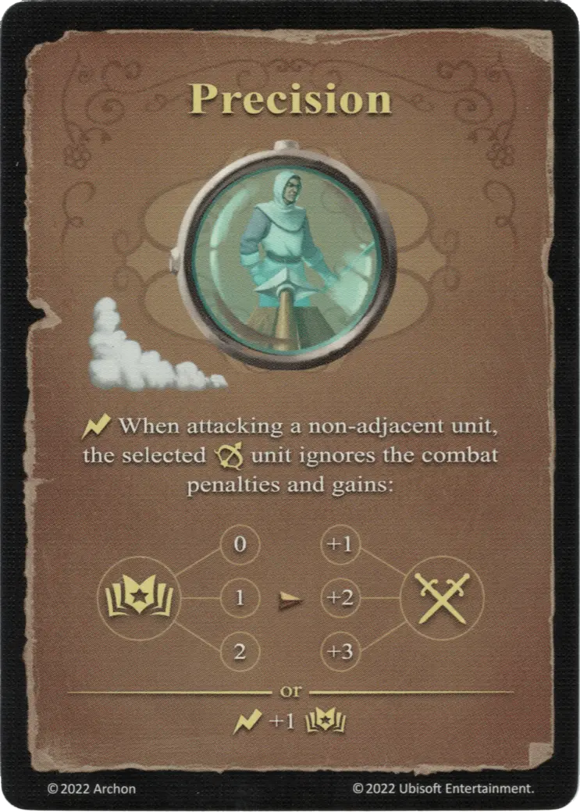

# Precision

{ width="340" align=right }

___

[Basic Air Spell](school_of_air_magic.md)

___

:instant: When attacking a non-adjacent [unit](../units/index.md), the selected :unit_ranged: [unit](../units/index.md) ignores the combat penalties and gains:  :empower: 0 ➣ +1 :attack: :empower: 1 ➣ +2 :attack: :empower: 2 ➣ +3 :attack:  — OR —  :instant: +1 :empower:

___

## Comes With

- [Rampart Expansion](../content/rampart_expansion.md)

## See Also

- [School of Air Magic](school_of_air_magic.md)
- [List of Spells](index.md)
