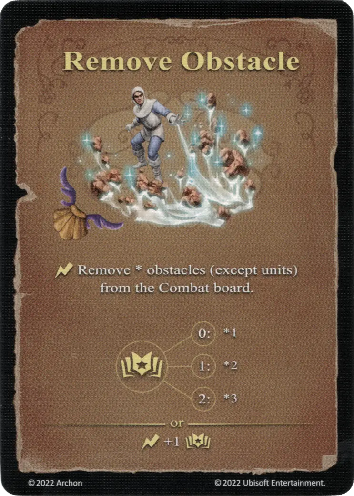

# Remove Obstacle

{ width="340" align=right }

___

[Basic Water Spell](index.md#school-of-water-magic)

___

:instant: Remove \* obstacles (except [units](../units/index.md)) from the Combat board.  :power: 0 ➣ \*1 :power: 1 ➣ \*2 :power: 2 ➣ \*3  — OR —  :instant: +1 :power:

___

## Notes

- Units can not be removed by this spell, despite counting as obstacles for movement purposes.
- Only the wall, the gate, and obstacle markers (on the large battlefield) may be removed by this spell.

## Comes With

- [Fortress Expansion](../content/fortress_expansion.md)

## See Also

- [School of Water Magic](index.md#school-of-water-magic)
- [List of Spells](index.md)
