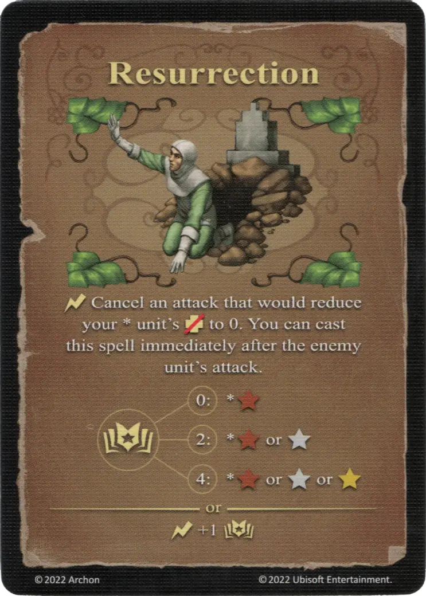

# Resurrection

{ width="340" align=right }

___

[Expert Earth Spell](school_of_earth_magic.md)

___

:instant: Cancel an attack that would reduce your \* [unit's](../units/index.md) :health_points: to 0. You can cast this spell immediately after the enemy [unit's](../units/index.md) attack.  :empower: 0 ➣ \*:bronze: :empower: 2 ➣ \*:bronze: or :silver: :empower: 4 ➣ \*:bronze: or :silver: or :golden:  — OR —  :instant: +1 :empower:

___

## Notes

- Only damage from an attack can be nullified. If the health points are reduced by other means of damage (such as abilities, spells, specialties, etc.), Resurrection cannot be played.
- If damage from an attack is nullified, the resurrected unit will not retaliate, even if it has not performed a retaliation this round.

## Comes With

- [Core Game](../content/core_game.md)

## See Also

- [School of Earth Magic](school_of_earth_magic.md)
- [List of Spells](index.md)
