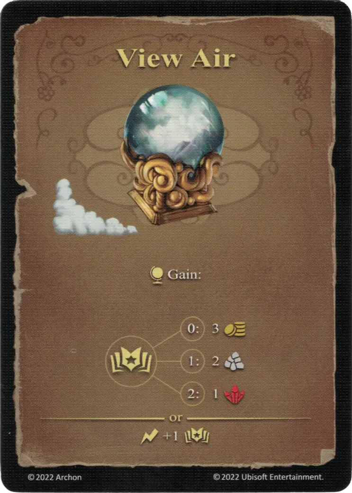

# View Air

{ width="340" align=right }

___

[Basic Air Spell](school_of_air_magic.md)

___

:effect_map: Gain:  :empower: 0 ➣ 3 :gold: :empower: 1 ➣ 2 :building_materials: :empower: 2 ➣ 1 :valuables:  — OR —  :instant: +1 :empower:

___

## Comes With

- [Tower Expansion](../content/tower_expansion.md)

## See Also

- [School of Air Magic](school_of_air_magic.md)
- [List of Spells](index.md)
