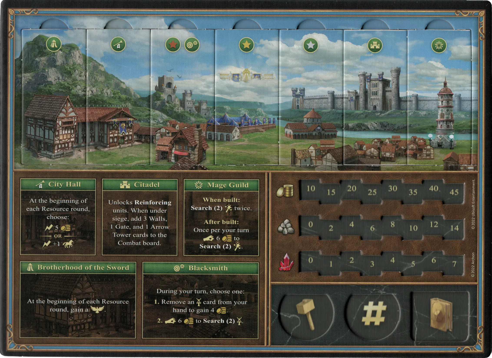

# Castle

## Buildings

=== "Empty"

    <figure markdown="span">
        { width="680" align=right }
    </figure>

=== "Fully Built"

    <figure markdown="span">
        { width="680" align=right }
    </figure>

=== "Back Side"

    <figure markdown="span">
        { width="680" align=right }
    </figure>

| Name | Building Cost | Effect |
| :--- | ---: | :---: |
| City Hall | 10 :gold: 4 :building_materials: 0 :valuables: | At the beginning of each Resource round, choose: :instant: 5 :gold:  — OR —  :instant: +1:movement: |
| Citadel | 8 :gold: 5 :building_materials: 1 :valuables: | Unlocks **Reinforcing** [units](#units). When under siege, add 3 Walls, 1 Gate, and 1 [Arrow Tower](../units/arrow_tower.md) cards to the Combat board. |
| Mage Guild | 4 :gold: 2 :building_materials: 1 :valuables: | **When built:** **Search(2)** [:spell:](../spells/index.md) twice.  **After built:** Once per your turn :pay: 6 :gold: to **Search(2)** [:spell:](../spells/index.md). |
| Towers | 5 :gold: 3 :building_materials: 1 :valuables: | Unlocks **Recruiting** of :bronze: [units](#units). |
| Holy Grounds | 8 :gold: 6 :building_materials: 3 :valuables: | Unlocks **Recruiting** of :silver: [units](#units). |
| Glory of Erathia | 10 :gold: 9 :building_materials: 4 :valuables: | Unlocks **Recruiting** of :golden: [units](#units). |
| Brotherhood of the Sword | 8 :gold: 4 :building_materials: 0 :valuables: | At the beginning of each Resource round, gain a :morale_positive:. |
| Blacksmith | 4 :gold: 3 :building_materials: 0 :valuables: | During your turn, choose one:  **1.** Remove an [:artifact:](../artifacts/index.md) card from your hand to gain 4 :gold:.  **2.** :pay: 6 :gold: to **Search(2)** [:artifact:](../artifacts/index.md). |

## Heroes

| Name | Class | Ability | Specialty |
| : --- | :--- | :--- | :--- |
| [Adelaide](../heroes/adelaide.md) | :magic: Cleric | [Wisdom](../abilities/wisdom.md) | [Frost Ring](../heroes/adelaide.md#specialty) |
| [Catherine](../heroes/catherine.md) | :might: Knight | [Leadership](../abilities/leadership.md) | [Crusaders](../heroes/catherine.md#specialty) |
| [Ingham](../heroes/ingham.md) | :magic: Cleric | [Mysticism](../abilities/mysticism.md) | [Zealots](../heroes/ingham.md#specialty) |
| [Lord Haart](../heroes/lord_haart_castle.md) | :might: Knight | [Estates](../abilities/estates.md) | [Estates](../heroes/lord_haart_castle.md#specialty) |
| [Tarnum](../heroes/tarnum_castle.md) | :might: Knight | [Artillery](../abilities/artillery.md) | [Ballista](../heroes/tarnum_castle.md#specialty) |
| [Rion](../heroes/rion.md) | :magic: Cleric | [Wisdom](../abilities/wisdom.md) | [Battlefield Medic](../heroes/rion.md#specialty) |
| [Valeska](../heroes/valeska.md) | :might: Knight | [Archery](../abilities/archery.md) | [Marksmen](../heroes/valeska.md#specialty) |

## Units

For the "Few" and "Pack" version of the same unit, stat changes are shown in **bold**.

| Name | # | Tier | Type | :attack: | :defense: | :health_points: | :initiative: | Recruitment Cost | Abilities |
| : --- | :---: | :---: | :---: | :---: | :---: | :---: | :---: | ---: | :--- |
| [Halberdiers](../units/halberdiers.md) | Few | :bronze: | [:unit_ground:](../units/index.md#ground-units) | 2 | 1 | 2 | 4 | 2 :gold: | - |
| [Halberdiers](../units/halberdiers.md) | Pack | :bronze: | [:unit_ground:](../units/index.md#ground-units) | **3** | 1 | 2 | **5** | 3 :gold: | :unit_passive: |
| [Marksmen](../units/marksmen.md) | Few | :bronze: | [:unit_ranged:](../units/index.md#ranged-units) | 2 | 0 | 2 | 4 | 3 :gold: | - |
| [Marksmen](../units/marksmen.md) | Pack | :bronze: | [:unit_ranged:](../units/index.md#ranged-units) | 2 | 0 | 2 | **6** | 5 :gold: | :unit_attack: |
| [Griffins](../units/griffins.md) | Few | :bronze: | [:unit_flying:](../units/index.md#flying-units) | 2 | 0 | 4 | 6 | 4 :gold: | :unit_retaliation: |
| [Griffins](../units/griffins.md) | Pack | :bronze: | [:unit_flying:](../units/index.md#flying-units) | **3** | 0 | 4 | **9** | 6 :gold: | :unit_retaliation: |
| [Crusaders](../units/crusaders.md) | Few | :silver: | [:unit_ground:](../units/index.md#ground-units) | 3 | 2 | 4 | 5 | 6 :gold: | - |
| [Crusaders](../units/crusaders.md) | Pack | :silver: | [:unit_ground:](../units/index.md#ground-units) | **4** | 2 | 4 | **6** | 10 :gold: | :unit_attack: |
| [Zealots](../units/zealots.md) | Few | :silver: | [:unit_ranged:](../units/index.md#ranged-units) | 3 | 1 | 5 | 5 | 8 :gold: | - |
| [Zealots](../units/zealots.md) | Pack | :silver: | [:unit_ranged:](../units/index.md#ranged-units) | **4** | 1 | 5 | **7** | 12 :gold: | :unit_passive: |
| [Champions](../units/champions.md) | Few | :golden: | [:unit_ground:](../units/index.md#ground-units) | 5 | 2 | 7 | 7 | 12 :gold: | :map_effect: |
| [Champions](../units/champions.md) | Pack | :golden: | [:unit_ground:](../units/index.md#ground-units) | **6** | 2 | 7 | **9** | 20 :gold: 1 :valuables: | :unit_attack: |
| [Archangels](../units/archangels.md) | Few | :golden: | [:unit_flying:](../units/index.md#flying-units) | 6 | 3 | 8 | 12 | 20 :gold: 1 :valuables: | :unit_passive: |
| [Archangels](../units/archangels.md) | Pack | :golden: | [:unit_flying:](../units/index.md#flying-units) | **7** | 3 | **10** | **18** | 30 :gold: 2 :valuables: | :unit_passive: |

## Comes With

- [Core Game](../content/core_game.md)

## See Also

- [List of Towns](../towns/index.md)