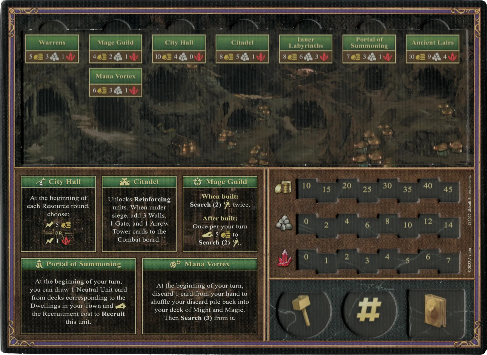
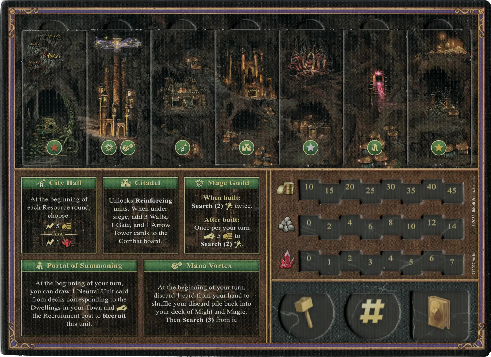
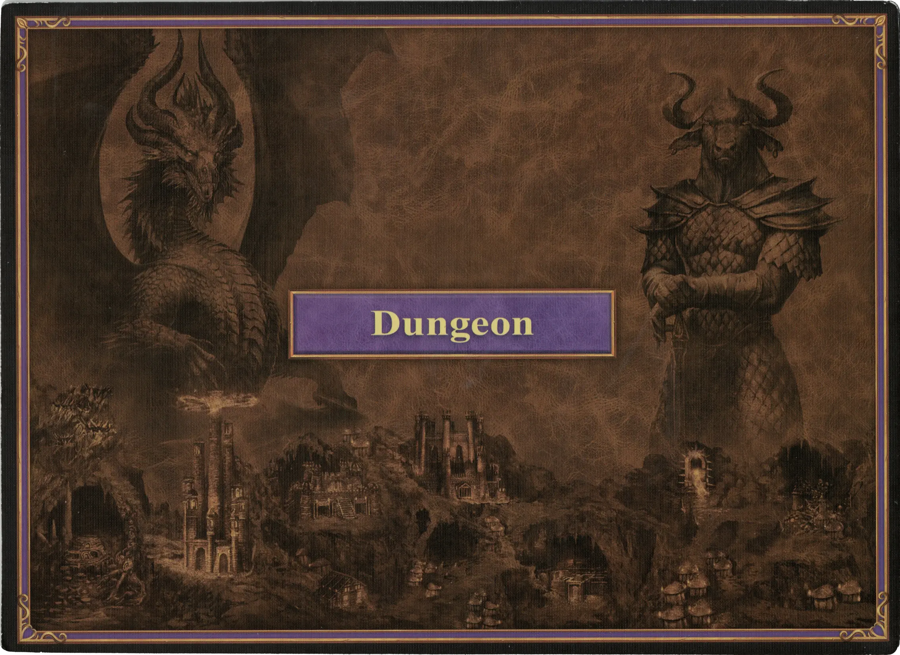

# Dungeon

## Buildings

=== "Empty"

    <figure markdown="span">
        { width="680" align=right }
    </figure>

=== "Fully Built"

    <figure markdown="span">
        { width="680" align=right }
    </figure>

=== "Back Side"

    <figure markdown="span">
        { width="680" align=right }
    </figure>

| Name | Building Cost | Effect |
| :--- | ---: | :---: |
| City Hall | 10 :gold: 4 :building_materials: 0 :valuables: | At the beginning of each Resource round, choose: :instant: 5 :gold:  — OR —  :instant: 1 :valuables: |
| Citadel | 8 :gold: 5 :building_materials: 1 :valuables: | Unlocks **Reinforcing** [units](#units). When under siege, add 3 Walls, 1 Gate, and 1 [Arrow Tower](../units/arrow_tower.md) cards to the Combat board. |
| Mage Guild | 4 :gold: 2 :building_materials: 1 :valuables: | **When built:** **Search(2)** [:spell:](../spells/index.md) twice.  **After built:** Once per your turn :pay: 5 :gold: to **Search(2)** [:spell:](../spells/index.md). |
| Warrens | 5 :gold: 3 :building_materials: 1 :valuables: | Unlocks **Recruiting** of :bronze: [units](#units). |
| Inner Labyrinths | 8 :gold: 6 :building_materials: 3 :valuables: | Unlocks **Recruiting** of :silver: [units](#units). |
| Ancient Lairs | 10 :gold: 9 :building_materials: 4 :valuables: | Unlocks **Recruiting** of :golden: [units](#units). |
| Portal of Summoning | 7 :gold: 3 :building_materials: 1 :valuables: | At the beginning of your turn, you can draw 1 [Neutral Unit](../units/index.md) card from decks corresponding to the Dwellings in your Town and :pay: the Recruitment cost to **Recruit** this [unit](../units/index.md). |
| Mana Vortex | 6 :gold: 4 :building_materials: 1 :valuables: | At the beginning of your turn, discard 1 card from your hand to shuffle your discard pile back into your deck of Might and Magic. Then **Search(3)** from it. |

## Heroes

| Name | Class | Ability | Specialty |
| : --- | :--- | :--- | :--- |
| [Alamar](../heroes/alamar.md) | :magic: Warlock | [Wisdom](../abilities/wisdom.md) | [Resurrection](../heroes/alamar.md#specialty) |
| [Deemer](../heroes/deemer.md) | :magic: Warlock | [Scouting](../abilities/scouting.md) | [Meteor Shower](../heroes/deemer.md#specialty) |
| [Jeddite](../heroes/jeddite.md) | :magic: Warlock | [Sorcery](../abilities/sorcery.md) | [Mysterious Warlock](../heroes/jeddite.md#specialty) |
| [Lorelei](../heroes/lorelei.md) | :might: Overlord | [Scouting](../abilities/scouting.md) | [Harpies](../heroes/lorelei.md#specialty) |
| [Mutare](../heroes/mutare.md) | :might: Overlord | [Tactics](../abilities/tactics.md) | [Dragons](../heroes/mutare.md#specialty) |
| [Sephinroth](../heroes/sephinroth.md) | :magic: Warlock | [Intelligence](../abilities/intelligence.md) | [Valuables](../heroes/sephinroth.md#specialty) |
| [Tarnum](../heroes/tarnum_dungeon.md) | :might: Overlord | [Estates](../abilities/estates.md) | [Dragons](../heroes/tarnum_dungeon.md#specialty) |

## Units

For the "Few" and "Pack" version of the same unit, stat changes are shown in **bold**.

| Name | # | Tier | Type | :attack: | :defense: | :health_points: | :initiative: | Recruitment Cost | Abilities |
| : --- | :---: | :---: | :---: | :---: | :---: | :---: | :---: | ---: | :--- |
| [Troglodytes](../units/troglodytes.md) | Few | :bronze: | [:ground_unit:](../units/index.md#ground-units) | 2 | 1 | 2 | 4 | 2 :gold: | - |
| [Troglodytes](../units/troglodytes.md) | Pack | :bronze: | [:ground_unit:](../units/index.md#ground-units) | **3** | 1 | 2 | **5** | 3 :gold: | :unit_passive: |
| [Harpies](../units/harpies.md) | Few | :bronze: | [:flying_unit:](../units/index.md#flying-units) | 2 | 0 | 3 | 6 | 3 :gold: | :unit_attack: |
| [Harpies](../units/harpies.md) | Pack | :bronze: | [:flying_unit:](../units/index.md#flying-units) | **3** | 0 | 3 | **9** | 5 :gold: | :unit_attack: |
| [Evil Eyes](../units/evil_eyes.md) | Few | :bronze: | [:unit_ranged:](../units/index.md#ranged-units) | 3 | 0 | 3 | 5 | 4 :gold: | - |
| [Evil Eyes](../units/evil_eyes.md) | Pack | :bronze: | [:unit_ranged:](../units/index.md#ranged-units) | 3 | **1** | 3 | **7** | 6 :gold: | :unit_passive: |
| [Medusas](../units/medusas.md) | Few | :silver: | [:unit_ranged:](../units/index.md#ranged-units) | 3 | 1 | 4 | 5 | 6 :gold: | :unit_passive: |
| [Medusas](../units/medusas.md) | Pack | :silver: | [:unit_ranged:](../units/index.md#ranged-units) | **4** | 1 | 4 | **6** | 12 :gold: | :unit_passive: :unit_retaliation: |
| [Minotaurs](../units/minotaurs.md) | Few | :silver: | [:ground_unit:](../units/index.md#ground-units) | 4 | 2 | 4 | 6 | 8 :gold: | :unit_attack: |
| [Minotaurs](../units/minotaurs.md) | Pack | :silver: | [:ground_unit:](../units/index.md#ground-units) | **5** | 2 | 4 | **8** | 14 :gold: | :unit_attack: |
| [Manticores](../units/manticores.md) | Few | :golden: | [:flying_unit:](../units/index.md#flying-units) | 5 | 1 | 6 | 7 | 10 :gold: | - |
| [Manticores](../units/manticores.md) | Pack | :golden: | [:flying_unit:](../units/index.md#flying-units) | 5 | 1 | 6 | **11** | 18 :gold: 1 :valuables: | :unit_attack: |
| [Manticores](../units/manticores.md) | Few (Alternate) | :golden: | [:flying_unit:](../units/index.md#flying-units) | 4 | 1 | 7 | 8 | 12 :gold: | :unit_attack: |
| [Manticores](../units/manticores.md) | Pack (Alternate) | :golden: | [:flying_unit:](../units/index.md#flying-units) | 4 | **2** | 7 | **11** | 18 :gold: 1 :valuables: | :unit_passive: |
| [Black Dragons](../units/black_dragons.md) | Few | :golden: | [:flying_unit:](../units/index.md#flying-units) | 6 | 3 | 8 | 11 | 19 :gold: 1 :valuables: | :unit_passive: |
| [Black Dragons](../units/black_dragons.md) | Pack | :golden: | [:flying_unit:](../units/index.md#flying-units) | **8** | 3 | 8 | **15** | 33 :gold: 2 :valuables: | :unit_passive: |

## Comes With

- [Core Game](../content/core_game.md)

## See Also

- [List of Towns](../towns/index.md)