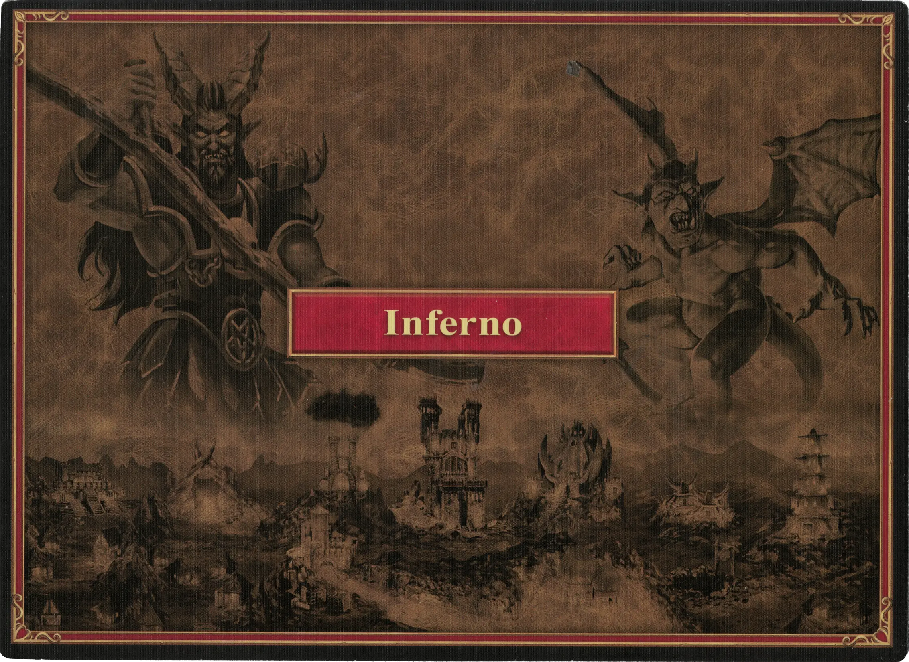

# Inferno

## Buildings

=== "Empty"

    <figure markdown="span">
        { width="680" align=right }
    </figure>

=== "Fully Built"

    <figure markdown="span">
        { width="680" align=right }
    </figure>

=== "Back Side"

    <figure markdown="span">
        { width="680" align=right }
    </figure>

| Name | Building Cost | Effect |
| :--- | ---: | :---: |
| City Hall | 13 :gold: 5 :building_materials: 0 :valuables: | At the beginning of each Resource round, choose: :instant: 6 :gold:  — OR —  :instant: 3 :building_materials: |
| Citadel | 9 :gold: 4 :building_materials: 1 :valuables: | Unlocks **Reinforcing** [units](#units). When under siege, add 3 Walls, 1 Gate, and 1 [Arrow Tower](../units/arrow_tower.md) cards to the Combat board. |
| Mage Guild | 4 :gold: 2 :building_materials: 1 :valuables: | **When built:** **Search(2)** [:spell:](../spells/index.md) twice.  **After built:** Once per your turn :pay: 5 :gold: to **Search(2)** [:spell:](../spells/index.md). |
| Crucible of Sins | 5 :gold: 3 :building_materials: 1 :valuables: | Unlocks **Recruiting** of :bronze: [units](#units). |
| Gates of Abyss | 9 :gold: 6 :building_materials: 3 :valuables: | Unlocks **Recruiting** of :silver: [units](#units). |
| Hellfire Palace | 10 :gold: 9 :building_materials: 4 :valuables: | Unlocks **Recruiting** of :golden: [units](#units). |
| Castle Gate | 7 :gold: 5 :building_materials: 0 :valuables: | During your turn, choose one:  **1.** :pay: 3 :gold: to discard 1 random card from your opponent's hand.  **2.** If your [Hero](#heroes) is in a Town or Settlement, move them to another Town or Settlement under your control. |
| Brimstone Stormclouds | 6 :gold: 3 :building_materials: 2 :valuables: | When built and at the beginning of each [Astrologer's round](../astrologers_proclaim/index.md), place your faction cube here (to a maximum of 3). During any Combat, you can remove them to gain +1:power: per 1 cube. Only one cube can be used per 1 [:spell:](../spells/index.md). |

## Heroes

| Name | Class | Ability | Specialty |
| : --- | :--- | :--- | :--- |
| [Ash](../heroes/ash.md) | :magic: Heretic | [Eagle Eye](../abilities/eagle_eye.md) | [Bloodlust](../heroes/ash.md#specialty) |
| [Fiona](../heroes/fiona.md) | :might: Demoniac | [Scouting](../abilities/scouting.md) | [Cerberi](../heroes/fiona.md#specialty) |
| [Octavia](../heroes/octavia.md) | :might: Demoniac | [Scholar](../abilities/scholar.md) | [Gold](../heroes/octavia.md#specialty) |
| [Rashka](../heroes/rashka.md) | :might: Demoniac | [Scholar](../abilities/scholar.md) | [Efreet](../heroes/rashka.md#specialty) |
| [Xyron](../heroes/xyron.md) | :magic: Heretic | [Wisdom](../abilities/wisdom.md) | [Inferno](../heroes/xyron.md#specialty) |
| [Zydar](../heroes/zydar.md) | :magic: Heretic | [Sorcery](../abilities/sorcery.md) | [Sorcery](../heroes/zydar.md#specialty) |

## Units

For the "Few" and "Pack" version of the same unit, stat changes are shown in **bold**.

| Name | # | Tier | Type | :attack: | :defense: | :health_points: | :initiative: | Recruitment Cost | Abilities |
| : --- | :---: | :---: | :---: | :---: | :---: | :---: | :---: | ---: | :--- |
| [Familiars](../units/familiars.md) | Few | :bronze: | [:unit_ground:](../units/index.md#ground-units) | 2 | 1 | 2 | 5 | 2 :gold: | - |
| [Familiars](../units/familiars.md) | Pack | :bronze: | [:unit_ground:](../units/index.md#ground-units) | **3** | 1 | 2 | **7** | 3 :gold: | :unit_passive: |
| [Magogs](../units/magogs.md) | Few | :bronze: | [:unit_ranged:](../units/index.md#ranged-units) | 2 | 0 | 2 | 4 | 3 :gold: | - |
| [Magogs](../units/magogs.md) | Pack | :bronze: | [:unit_ranged:](../units/index.md#ranged-units) | 2 | 0 | **3** | **6** | 5 :gold: | :unit_attack: |
| [Cerberi](../units/cerberi.md) | Few | :bronze: | [:unit_ground:](../units/index.md#ground-units) | 3 | 0 | 4 | 7 | 4 :gold: | - |
| [Cerberi](../units/cerberi.md) | Pack | :bronze: | [:unit_ground:](../units/index.md#ground-units) | 3 | **1** | **5** | **8** | 7 :gold: | :unit_attack: |
| [Demons](../units/demons.md) | Few | :silver: | [:unit_ground:](../units/index.md#ground-units) | 3 | 2 | 4 | 5 | 6 :gold: | - |
| [Demons](../units/demons.md) | Pack | :silver: | [:unit_ground:](../units/index.md#ground-units) | 3 | 2 | **5** | **6** | 8 :gold: | - |
| [Pit Lords](../units/pit_lords.md) | Few | :silver: | [:unit_ground:](../units/index.md#ground-units) | 4 | 1 | 6 | 6 | 8 :gold: | - |
| [Pit Lords](../units/pit_lords.md) | Pack | :silver: | [:unit_ground:](../units/index.md#ground-units) | **5** | 1 | 6 | **7** | 15 :gold: | :unit_other: |
| [Efreet](../units/efreet.md) | Few | :golden: | [:unit_flying:](../units/index.md#flying-units) | 5 | 1 | 7 | 9 | 12 :gold: | :unit_passive: |
| [Efreet](../units/efreet.md) | Pack | :golden: | [:unit_flying:](../units/index.md#flying-units) | **6** | 1 | 7 | **13** | 18 :gold: 1 :valuables: | :unit_passive: |
| [Arch Devils](../units/arch_devils.md) | Few | :golden: | [:unit_flying:](../units/index.md#flying-units) | 6 | 3 | 8 | 11 | 22 :gold: 1 :valuables: | :unit_attack: |
| [Arch Devils](../units/arch_devils.md) | Pack | :golden: | [:unit_flying:](../units/index.md#flying-units) | **7** | 3 | **9** | **15** | 30 :gold: 2 :valuables: | :unit_attack: :unit_passive: |

## Comes With

- [Inferno Expansion](../content/inferno_expansion.md)

## See Also

- [List of Towns](../towns/index.md)