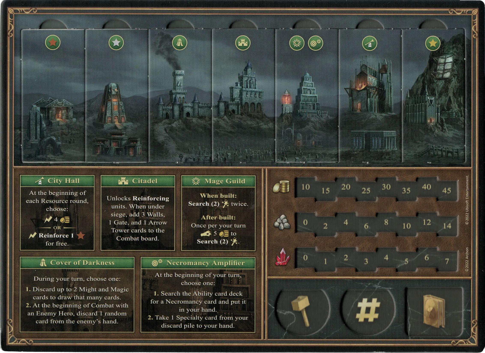
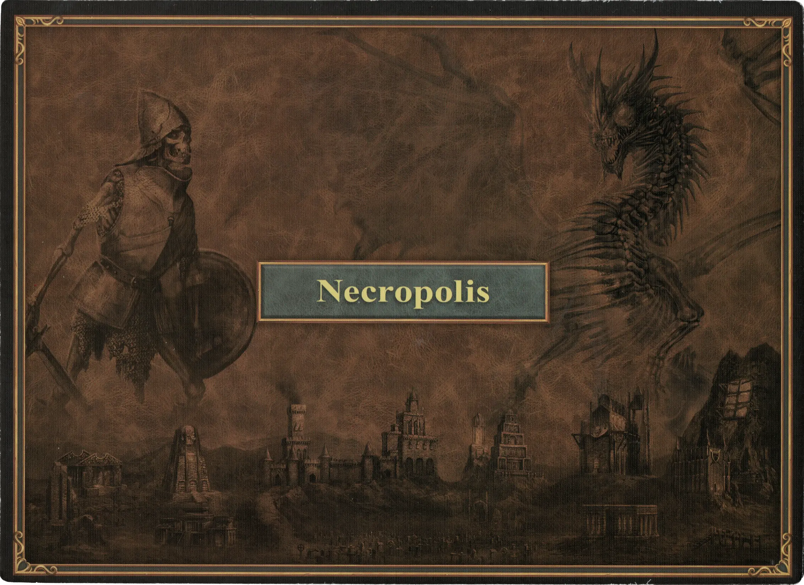

# Necropolis

Also shown as :necropolis:.

## Buildings

=== "Empty"

    <figure markdown="span">
        { width="680" align=right }
    </figure>

=== "Fully Built"

    <figure markdown="span">
        { width="680" align=right }
    </figure>

=== "Back Side"

    <figure markdown="span">
        { width="680" align=right }
    </figure>

| Name | Building Cost | Effect |
| :--- | ---: | :---: |
| City Hall | 10 :gold: 4 :building_materials: 0 :valuables: | At the beginning of each Resource round, choose: :instant: 4 :gold:  — OR —  :instant:**Reinforce 1** :bronze: for free. |
| Citadel | 8 :gold: 5 :building_materials: 1 :valuables: | Unlocks **Reinforcing** [units](#units). When under siege, add 3 Walls, 1 Gate, and 1 [Arrow Tower](../units/arrow_tower.md) cards to the Combat board. |
| Mage Guild | 4 :gold: 2 :building_materials: 1 :valuables: | **When built:** **Search(2)** [:spell:](../spells/index.md) twice.  **After built:** Once per your turn :pay: 5 :gold: to **Search(2)** [:spell:](../spells/index.md). |
| Old Cemetery | 5 :gold: 3 :building_materials: 1 :valuables: | Unlocks **Recruiting** of :bronze: [units](#units). |
| Mausoleum Domain | 8 :gold: 6 :building_materials: 3 :valuables: | Unlocks **Recruiting** of :silver: [units](#units). |
| Vaults of Darkness | 10 :gold: 9 :building_materials: 4 :valuables: | Unlocks **Recruiting** of :golden: [units](#units). |
| Necromancy Amplifier | 7 :gold: 3 :building_materials: 1 :valuables: | At the beginning of your turn, choose one:  **1.** Search the [Ability](../abilities/index.md) card deck for a [Necromancy](../abilities/index.md) card and put it in your hand.  **2.** Take 1 [Specialty](#heroes) card from your discard pile to your hand. |
| Cover of Darkness | 6 :gold: 4 :building_materials: 1 :valuables: | During your turn, choose one:  **1.** Discard up to 2 Might and Magic cards to draw that many cards.  **2.** At the beginning of Combat with an Enemy [Hero](../heroes/index.md), discard 1 random card from the enemy's hand. |

## Heroes

| Name | Class | Ability | Specialty |
| : --- | :--- | :--- | :--- |
| [Lord Haart](../heroes/lord_haart_necropolis.md) | :might: Death Knight | [Necromancy](../abilities/necromancy.md) | [Dread Knights](../heroes/lord_haart_necropolis.md#specialty) |
| [Moandor](../heroes/moandor.md) | :might: Death Knight | [Necromancy](../abilities/necromancy.md) | [Liches](../heroes/moandor.md#specialty) |
| [Sandro](../heroes/sandro.md) | :magic: Necromancer | [Sorcery](../abilities/sorcery.md) | [Cloak of the Undead King](../heroes/sandro.md#specialty) |
| [Septienna](../heroes/septienna.md) | :magic: Necromancer | [Necromancy](../abilities/necromancy.md) | [Death Ripple](../heroes/septienna.md#specialty) |
| [Tamika](../heroes/tamika.md) | :might: Death Knight | [Offense](../abilities/offense.md) | [Dread Knights](../heroes/tamika.md#specialty) |
| [Vidomina](../heroes/vidomina.md) | :magic: Necromancer | [Necromancy](../abilities/necromancy.md) | [Necromancy](../heroes/vidomina.md#specialty) |

## Units

For the "Few" and "Pack" version of the same unit, stat changes are shown in **bold**.

| Name | # | Tier | Type | :attack: | :defense: | :health_points: | :initiative: | Recruitment Cost | Abilities |
| : --- | :---: | :---: | :---: | :---: | :---: | :---: | :---: | ---: | :--- |
| [Skeletons](../units/skeletons.md) | Few | :bronze: | [:ground_unit:](../units/index.md#ground-units) | 2 | 1 | 2 | 4 | 2 :gold: | - |
| [Skeletons](../units/skeletons.md) | Pack | :bronze: | [:ground_unit:](../units/index.md#ground-units) | **3** | 1 | 2 | **5** | 3 :gold: | - |
| [Zombies](../units/zombies.md) | Few | :bronze: | [:ground_unit:](../units/index.md#ground-units) | 2 | 1 | 3 | 3 | 3 :gold: | :unit_passive: |
| [Zombies](../units/zombies.md) | Pack | :bronze: | [:ground_unit:](../units/index.md#ground-units) | 2 | 1 | 3 | **4** | 4 :gold: | :unit_passive: |
| [Wraiths](../units/wraiths.md) | Few | :bronze: | [:flying_unit:](../units/index.md#flying-units) | 3 | 0 | 3 | 5 | 4 :gold: | :activation: |
| [Wraiths](../units/wraiths.md) | Pack | :bronze: | [:flying_unit:](../units/index.md#flying-units) | 3 | 0 | **5** | **7** | 6 :gold: | :activation: |
| [Vampires](../units/vampires.md) | Few | :silver: | [:flying_unit:](../units/index.md#flying-units) | 4 | 1 | 4 | 6 | 8 :gold: | :unit_attack: |
| [Vampires](../units/vampires.md) | Pack | :silver: | [:flying_unit:](../units/index.md#flying-units) | **5** | 1 | 4 | **9** | 12 :gold: | :unit_attack: |
| [Liches](../units/liches.md) | Few | :silver: | [:ranged_unit:](../units/index.md#ranged-units) | 3 | 1 | 5 | 6 | 8 :gold: | - |
| [Liches](../units/liches.md) | Pack | :silver: | [:ranged_unit:](../units/index.md#ranged-units) | **4** | 1 | 5 | **7** | 14 :gold: | :unit_attack: |
| [Dread Knights](../units/dread_knights.md) | Few | :golden: | [:ground_unit:](../units/index.md#ground-units) | 5 | 2 | 7 | 7 | 12 :gold: | :unit_attack: |
| [Dread Knights](../units/dread_knights.md) | Pack | :golden: | [:ground_unit:](../units/index.md#ground-units) | **6** | 2 | 7 | **9** | 20 :gold: 1 :valuables: | :unit_attack: |
| [Ghost Dragons](../units/ghost_dragons.md) | Few | :golden: | [:flying_unit:](../units/index.md#flying-units) | 6 | 3 | 8 | 9 | 19 :gold: 1 :valuables: | :activation: |
| [Ghost Dragons](../units/ghost_dragons.md) | Pack | :golden: | [:flying_unit:](../units/index.md#flying-units) | **7** | 3 | **9** | **14** | 32 :gold: 2 :valuables: | :activation: :unit_attack: |

## Abilities

- :necropolis: [Necromancy](../abilities/necromancy.md)

## Comes With

- [Core Game](../content/core_game.md)

## See Also

- [List of Towns](../towns/index.md)