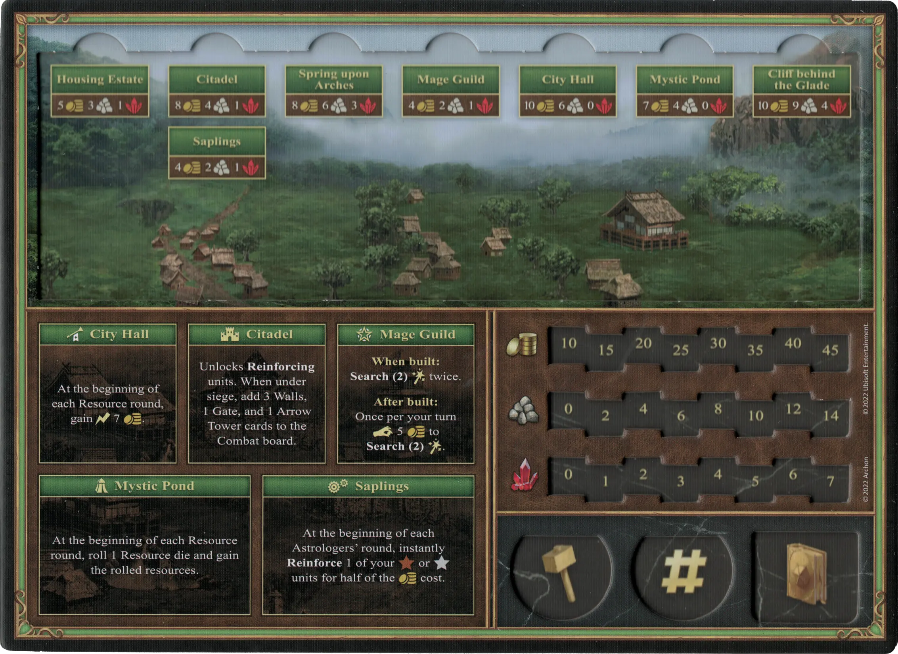

# Rampart

## Buildings

=== "Empty"

    <figure markdown="span">
        { width="680" align=right }
    </figure>

=== "Fully Built"

    <figure markdown="span">
        { width="680" align=right }
    </figure>

=== "Back Side"

    <figure markdown="span">
        { width="680" align=right }
    </figure>

| Name | Building Cost | Effect |
| :--- | ---: | :---: |
| City Hall | 10 :gold: 6 :building_materials: 0 :valuables: | At the beginning of each Resource round, gain :instant: 7 :gold:. |
| Citadel | 8 :gold: 5 :building_materials: 1 :valuables: | Unlocks **Reinforcing** [units](#units). When under siege, add 3 Walls, 1 Gate, and 1 [Arrow Tower](../units/arrow_tower.md) cards to the Combat board. |
| Mage Guild | 4 :gold: 2 :building_materials: 1 :valuables: | **When built:** **Search(2)** [:spell:](../spells/index.md) twice.  **After built:** Once per your turn :pay: 5 :gold: to **Search(2)** [:spell:](../spells/index.md). |
| Housing Estate | 5 :gold: 3 :building_materials: 1 :valuables: | Unlocks **Recruiting** of :bronze: [units](#units). |
| Spring upon Arches | 8 :gold: 6 :building_materials: 3 :valuables: | Unlocks **Recruiting** of :silver: [units](#units). | 
| Cliff behind the Glade | 10 :gold: 9 :building_materials: 4 :valuables: | Unlocks **Recruiting** of :golden: [units](#units). |
| Mystic Pond | 7 :gold: 4 :building_materials: 0 :valuables: | At the beginning of each Resource round, roll 1 [Resource die](../keywords/dice.md#resource-die) and gain the rolled resources. |
| Saplings | 4 :gold: 2 :building_materials: 1 :valuables: | At the beginning of each [Astrologer's round](../astrologers_proclaim/index.md), instantly **Reinforce** 1 of your :bronze: or :silver: [units](#units) for half of the  :gold: cost. |

## Heroes

| Name | Class | Ability | Specialty |
| :--- | :--- | :--- | :--- |
| [Clancy](../heroes/clancy.md) | :might: Ranger | [Pathfinding](../abilities/pathfinding.md) | [Unicorns](../heroes/clancy.md#specialty) |
| [Gelu](../heroes/gelu.md) | :might: Ranger | [Archery](../abilities/archery.md) | [Sharpshooters](../heroes/gelu.md#specialty) |
| [Gem](../heroes/gem.md) | :magic: Druid | [First Aid](../abilities/first_aid.md) | [First Aid](../heroes/gem.md#specialty) |
| [Ivor](../heroes/ivor.md) | :might: Ranger | [Offense](../abilities/offense.md) | [Elves](../heroes/ivor.md#specialty) |
| [Melodia](../heroes/melodia.md) | :magic: Druid | [Luck](../abilities/luck.md) | [Fortune](../heroes/melodia.md#specialty) |
| [Mephala](../heroes/mephala.md) | :might: Ranger | [Leadership](../abilities/leadership.md) | [Armorer](../heroes/mephala.md#specialty) |
| [Tarnum](../heroes/tarnum_rampart.md) | :might: Ranger | [Leadership](../abilities/leadership.md) | [Sharpshooters](../heroes/tarnum_rampart.md#specialty) |

## Units

For the "Few" and "Pack" version of the same unit, stat changes are shown in **bold**.

| Name | # | Tier | Type | :attack: | :defense: | :health_points: | :initiative: | Recruitment Cost | Abilities |
| :--- | :---: | :---: | :---: | :---: | :---: | :---: | :---: | ---: | :--- |
| [Centaurs](../units/centaurs.md) | Few | :bronze: | [:ground_unit:](../units/index.md#ground-units) | 2 | 0 | 3 | 6 | 2 :gold: | - |
| [Centaurs](../units/centaurs.md) | Pack | :bronze: | [:ground_unit:](../units/index.md#ground-units) | **3** | 0 | 3 | **8** | 3 :gold: | - |
| [Dwarves](../units/dwarves.md) | Few | :bronze: | [:ground_unit:](../units/index.md#ground-units) | 2 | 1 | 3 | 3 | 3 :gold: | :unit_passive: |
| [Dwarves](../units/dwarves.md) | Pack | :bronze: | [:ground_unit:](../units/index.md#ground-units) | **3** | 1 | 3 | **5** | 4 :gold: | :unit_passive: |
| [Elves](../units/elves.md) | Few | :bronze: | [:ranged_unit:](../units/index.md#ranged-units) | 2 | 1 | 3 | 6 | 4 :gold: | - |
| [Elves](../units/elves.md) | Pack | :bronze: | [:ranged_unit:](../units/index.md#ranged-units) | **3** | 1 | 3 | **7** | 7 :gold: | :unit_attack: |
| [Pegasi](../units/pegasi.md) | Few | :silver: | [:flying_unit:](../units/index.md#flying-units) | 3 | 0 | 5 | 8 | 6 :gold: | - |
| [Pegasi](../units/pegasi.md) | Pack | :silver: | [:flying_unit:](../units/index.md#flying-units) | **4** | 0 | **6** | **12** | 10 :gold: | :unit_passive: |
| [Dendroids](../units/dendroids.md) | Few | :silver: | [:ground_unit:](../units/index.md#ground-units) | 4 | 2 | 5 | 3 | 8 :gold: | - |
| [Dendroids](../units/dendroids.md) | Pack | :silver: | [:ground_unit:](../units/index.md#ground-units) | 4 | 2 | **6** | **4** | 15 :gold: | :unit_passive: |
| [Unicorns](../units/unicorns.md) | Few | :golden: | [:ground_unit:](../units/index.md#ground-units) | 5 | 1 | 8 | 7 | 11 :gold: | :unit_passive: |
| [Unicorns](../units/unicorns.md) | Pack | :golden: | [:ground_unit:](../units/index.md#ground-units) | **6** | 1 | 8 | **9** | 18 :gold: 1 :valuables: | :unit_passive: |
| [Gold Dragons](../units/gold_dragons.md) | Few | :golden: | [:flying_unit:](../units/index.md#flying-units) | 5 | 3 | 9 | 10 | 22 :gold: 1 :valuables: | :unit_attack: |
| [Gold Dragons](../units/gold_dragons.md) | Pack | :golden: | [:flying_unit:](../units/index.md#flying-units) | **6** | 3 | **10** | **16** | 30 :gold: 2 :valuables: | :unit_attack: |

## Comes With

- [Rampart Expansion](../content/rampart_expansion.md)

## See Also

- [List of Towns](../towns/index.md)