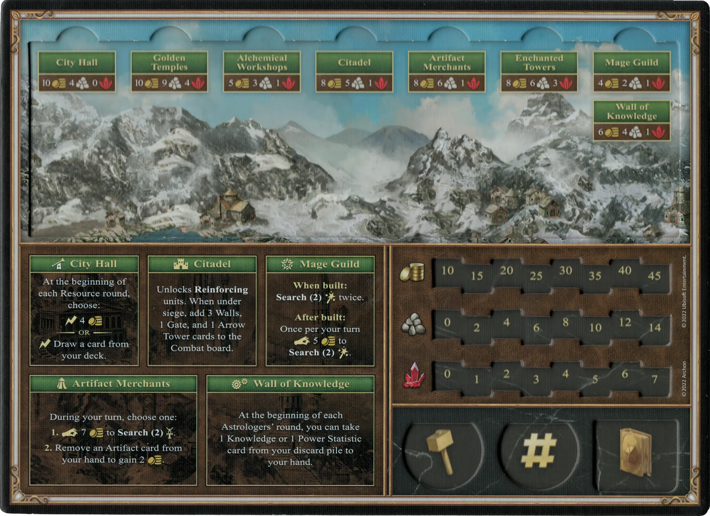
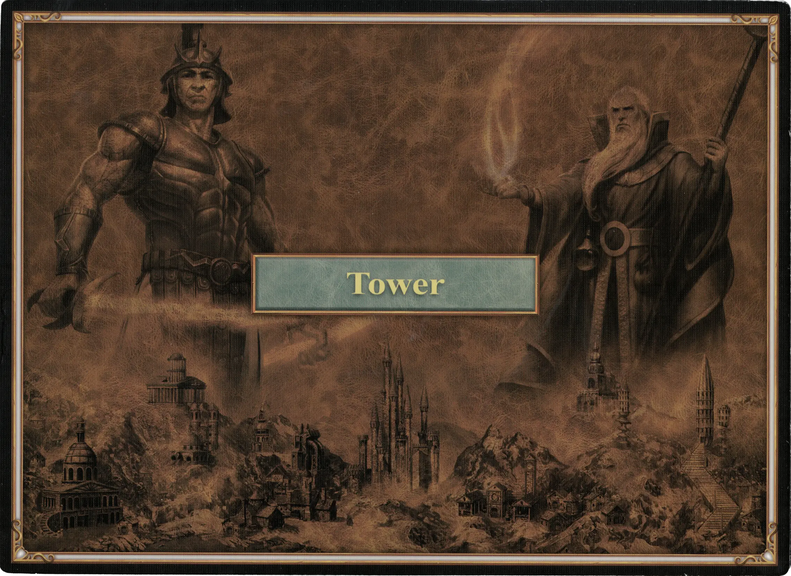

# Tower

## Buildings

=== "Empty"

    <figure markdown="span">
        { width="680" align=right }
    </figure>

=== "Fully Built"

    <figure markdown="span">
        { width="680" align=right }
    </figure>

=== "Back Side"

    <figure markdown="span">
        { width="680" align=right }
    </figure>

| Name | Building Cost | Effect |
| :--- | ---: | :---: |
| City Hall | 10 :gold: 4 :building_materials: 0 :valuables: | At the beginning of each Resource round, choose: :instant: 4 :gold:  — OR —  :instant: Draw a card from your deck. |
| Citadel | 8 :gold: 5 :building_materials: 1 :valuables: | Unlocks **Reinforcing** [units](#units). When under siege, add 3 Walls, 1 Gate, and 1 [Arrow Tower](../units/arrow_tower.md) cards to the Combat board. |
| Mage Guild | 4 :gold: 2 :building_materials: 1 :valuables: | **When built:** **Search(2)** [:spell:](../spells/index.md) twice.  **After built:** Once per your turn :pay: 5 :gold: to **Search(2)** [:spell:](../spells/index.md). |
| Alchemical Workshop | 5 :gold: 3 :building_materials: 1 :valuables: | Unlocks **Recruiting** of :bronze_tier: [units](#units). |
| Enchanted Towers | 8 :gold: 6 :building_materials: 3 :valuables: | Unlocks **Recruiting** of :silver_tier: [units](#units). |
| Golden Temples | 10 :gold: 9 :building_materials: 4 :valuables: | Unlocks **Recruiting** of :gold_tier: [units](#units). |
| Artifact Merchants | 8 :gold: 6 :building_materials: 1 :valuables: | During your turn, choose one:  **1.** :pay: 7 :gold: to **Search(2)** [:artifact:](../artifacts/index.md).  **2.** Remove an [Artifact](../artifacts/index.md) card from your hand to gain 2 :gold:. |
| Wall of Knowledge | 6 :gold: 4 :building_materials: 1 :valuables: | At the beginning of each [Astrologer's round](../astrologers_proclaim/index.md), you can take 1 [Knowledge](../statistics/knowledge.md) or 1 [Power Statistic](../statistics/power.md) card from your discard pile to your hand. |

## Heroes

| Name | Class | Ability | Specialty |
| :--- | :--- | :--- | :--- |
| [Cyra](../heroes/cyra.md) | :magic: Wizard | [Diplomacy](../abilities/diplomacy.md) | [Haste](../heroes/cyra.md#specialty) |
| [Dracon](../heroes/dracon.md) | :magic: Wizard | [Wisdom](../abilities/wisdom.md) | [Enchanters](../heroes/dracon.md#specialty) |
| [Iona](../heroes/iona.md) | :might: Alchemist | [Intelligence](../abilities/intelligence.md) | [Genies](../heroes/iona.md#specialty) |
| [Josephine](../heroes/josephine.md) | :might: Alchemist | [Sorcery](../abilities/sorcery.md) | [Golems](../heroes/josephine.md#specialty) |
| [Solmyr](../heroes/solmyr.md) | :magic: Wizard | [Sorcery](../abilities/sorcery.md) | [Chain Lightning](../heroes/solmyr.md#specialty) |
| [Torosar](../heroes/torosar.md) | :might: Wizard | [Mysticism](../abilities/mysticism.md) | [Ballista](../heroes/torosar.md#specialty) |

## Units

For the "Few" and "Pack" version of the same unit, stat changes are shown in **bold**.

| Name | # | Tier | Type | :attack: | :defense: | :health_points: | :initiative: | Recruitment Cost | Abilities |
| :--- | :---: | :---: | :---: | :---: | :---: | :---: | :---: | ---: | :--- |
| [Gremlins](../units/gremlins.md#few) | Few | :bronze_tier: | [:ground_unit:](../units/index.md#ground-units) | 2 | 0 | 2 | 4 | 0 :gold: | - |
| [Gremlins](../units/gremlins.md#pack) | Pack | :bronze_tier: | [:ranged_unit:](../units/index.md#ranged-units) | 2 | 0 | 2 | **5** | 2 :gold: | - |
| [Gargoyles](../units/gargoyles.md#few) | Few | :bronze_tier: | [:flying_unit:](../units/index.md#flying-units) | 2 | 1 | 3 | 6 | 3 :gold: | :unit_passive: :ongoing: |
| [Gargoyles](../units/gargoyles.md#pack) | Pack | :bronze_tier: | [:flying_unit:](../units/index.md#flying-units) | **3** | 1 | 3 | **9** | 4 :gold: | :unit_passive: :ongoing: |
| [Iron Golems](../units/iron_golems.md#few) | Few | :bronze_tier: | [:ground_unit:](../units/index.md#ground-units) | 3 | 1 | 3 | 4 | 4 :gold: | :unit_passive: |
| [Iron Golems](../units/iron_golems.md#pack) | Pack | :bronze_tier: | [:ground_unit:](../units/index.md#ground-units) | 3 | **2** | 3 | **5** | 7 :gold: | :unit_passive: |
| [Magi](../units/magi.md#few) | Few | :silver_tier: | [:ranged_unit:](../units/index.md#ranged-units) | 3 | 0 | 4 | 5 | 6 :gold: | :unit_attack: |
| [Magi](../units/magi.md#pack) | Pack | :silver_tier: | [:ranged_unit:](../units/index.md#ranged-units) | **4** | **1** | 4 | 6 | 11 :gold: | :unit_attack: :activation: |
| [Genies](../units/genies.md#few) | Few | :silver_tier: | [:flying_unit:](../units/index.md#flying-units) | 3 | 1 | 6 | 7 | 8 :gold: | :unit_other: |
| [Genies](../units/genies.md#pack) | Pack | :silver_tier: | [:flying_unit:](../units/index.md#flying-units) | **4** | 1 | 6 | **8** | 12 :gold: | :unit_attack: |
| [Nagas](../units/nagas.md#few) | Few | :gold_tier: | [:ground_unit:](../units/index.md#ground-units) | 5 | 2 | 7 | 6 | 13 :gold: | :unit_attack: |
| [Nagas](../units/nagas.md#pack) | Pack | :gold_tier: | [:ground_unit:](../units/index.md#ground-units) | **6** | 2 | 7 | **8** | 18 :gold: 1 :valuables: | :unit_attack: |
| [Titans](../units/titans.md#few) | Few | :gold_tier: | [:ground_unit:](../units/index.md#ground-units) | 6 | 3 | 8 | 7 | 18 :gold: 1 :valuables: | :unit_passive: :ongoing: |
| [Titans](../units/titans.md#pack) | Pack | :gold_tier: | [:ranged_unit:](../units/index.md#ranged-units) | 6 | 3 | 8 | **11** | 32 :gold: 2 :valuables: | :unit_passive: :ongoing: |

## Comes With

- [Tower Expansion](../content/tower_expansion.md)

## See Also

- [List of Towns](../towns/index.md)