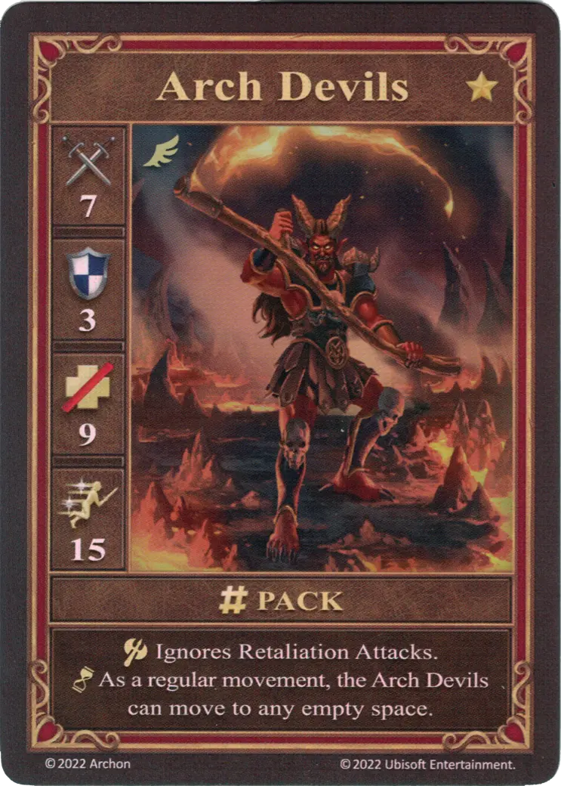

# Arch Devils (Alt 2)

=== "Few"

	<figure markdown="span">
		{ width="340" align=right }
	</figure>

=== "Pack "

	<figure markdown="span">
		{ width="340" align=right }
	</figure>

=== "Neutral"

	<figure markdown="span">
		{ width="340" align=right }
	</figure>

| Statistics | Few | Pack | Neutral |
| :--- | :---: | :---: | :---: |
| Town | :golden: [Inferno](../towns/inferno.md) | :golden: [Inferno](../towns/inferno.md) | :golden: [Neutral](../towns/neutral.md) |
| Type | :unit_flying: | :unit_flying: | :unit_flying: |
| :attack: | 6 | **7** | 5 |
| :defense: | 3 | 3 | 2 |
| :health_points: | 8 | **9** | 7 |
| :initiative: | 11 | **15** | 10 |
| Cost | 22 :gold: 1 :valuables: | 30 :gold: 2 :valuables: | 23 :gold: |
| Abilities | :unit_attack: Ignores Retaliation Attacks. | :unit_attack: Ignores Retaliation Attacks. :unit_passive: As a regular movement, the Arch Devils can move to any empty space. | :unit_attack: When attacking [Archangels](archangels.md), this unit gains +2 :attack:. |

## Comes With

- [Inferno Expansion](../content.md)

## See Also

- [List of Units](index.md)
- [List of Towns](../towns/index.md)
