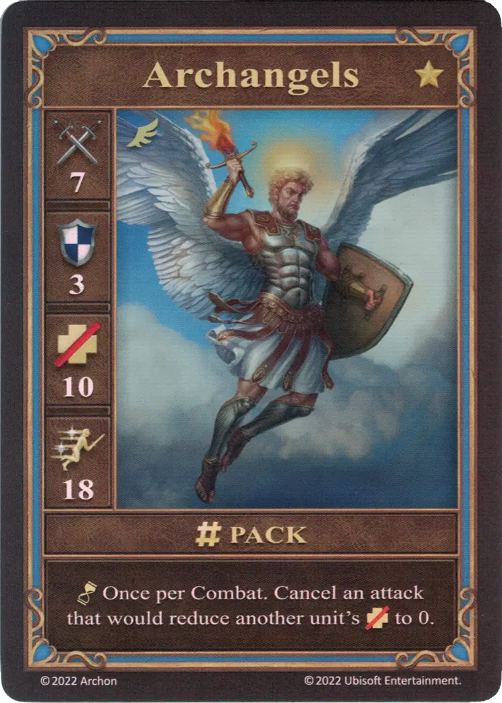

# Archangels

=== "Few"

    <figure markdown="span">
        { width="340" align=right }
    </figure>

=== "Pack"

    <figure markdown="span">
        { width="340" align=right }
    </figure>

=== "Neutral"

    <figure markdown="span">
        { width="340" align=right }
    </figure>

| Statistics | Few | Pack | Neutral |
| :--- | :---: | :---: | :---: |
| Town | [Castle](../towns/castle.md) | [Castle](../towns/castle.md) | [Neutral](../towns/neutral.md) |
| Tier | :golden: | :golden: | :golden: |
| Type | [:unit_flying:](index.md#flying-units) | [:unit_flying:](index.md#flying-units) | [:unit_flying:](index.md#flying-units) |
| :attack: | 6 | **7** | 5 |
| :defense: | 3 | 3 | 2 |
| :health_points: | 8 | **10** | 7 |
| :initiative: | 12 | **18** | 10 |
| Cost | 20 :gold: 1 :valuables: | 30 :gold: 2 :valuables: | 29 :gold: |
| Abilities | :unit_passive: When combat begins, draw 1 card. | :unit_passive: Once per Combat. Cancel an attack that would reduce another unit's :health_points: to 0. | :unit_attack: When attacking [Arch Devils](arch_devils.md), this unit gains +2 :attack:. |

## Notes

- **Pack** - The passive ability can be used at the moment when a friendly unit would be defeated.
- **Pack** - See [Resurrection Spell](../spells/resurrection.md)

## Comes With

- [Core Game](../content/core_game.md)

## See Also

- [List of Units](index.md)
- [List of Towns](../towns/index.md)