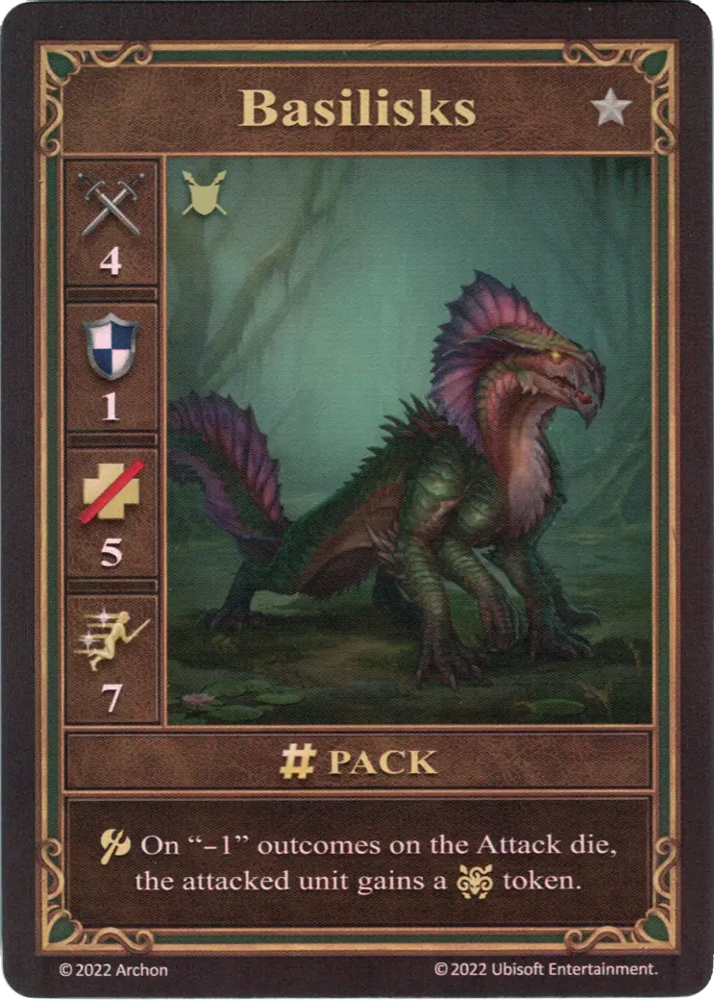

# Basilisks

=== "Few"

    <figure markdown="span">
        { width="340" align=right }
    </figure>

=== "Pack"

    <figure markdown="span">
        { width="340" align=right }
    </figure>

=== "Neutral"

    <figure markdown="span">
        { width="340" align=right }
    </figure>

| Statistics | Few | Pack | Neutral |
| :--- | :---: | :---: | :---: |
| Town | [Fortress](../towns/fortress.md) | [Fortress](../towns/fortress.md) | [Neutral](../towns/neutral.md) |
| Tier | :silver: | :silver: | :silver: |
| Type | [:unit_ground:](index.md#ground-units) | [:unit_ground:](index.md#ground-units) | [:unit_ground:](index.md#ground-units) |
| :attack: | 4 | 4 | 4 |
| :defense: | 1 | 1 | 1 |
| :health_points: | 4 | **5** | 4 |
| :initiative: | 5 | **7** | 5 |
| Cost | 6 :gold: | 9 :gold: | 12 :gold: |
| Abilities | :unit_attack: On "-1" outcomes on the [Attack die](../keywords/dice.md#attack-die), the attacked unit gains a :paralysis: token. | :unit_attack: On "-1" outcomes on the [Attack die](../keywords/dice.md#attack-die), the attacked unit gains a :paralysis: token. | :unit_attack: After the attack, roll 1 [Attack die](../keywords/dice.md#attack-die). On a "0" result, :paralysis: the target. |

## Heroes With A Specialty

- [:might: Bron](../heroes/bron.md#specialty)

## Notes

- See [Paralysis](../keywords/paralysis.md)

## Comes With

- [Fortress Expansion](../content/fortress_expansion.md)
- [Tower Expansion](../content/tower_expansion.md) (Neutral)

## See Also

- [List of Units](index.md)
- [List of Towns](../towns/index.md)