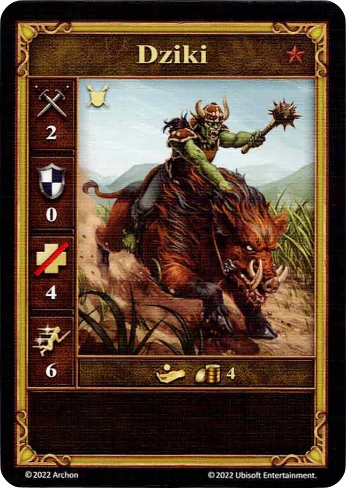

# Dziki

<figure markdown="span">
    { width="340" align=right }
</figure>

| Statystyki | Neutralne |
| :--- | :---: |
| Miasto | [Neutralne](../towns/neutral.md) |
| Poziom | :bronze: |
| Typ | [:unit_ground:](../keywords/ground_unit.md) |
| :attack: | 2 |
| :defense: | 0 |
| :health_points: | 4 |
| :initiative: | 6 |
| Koszt | 4 :gold: |
| Zdolności | - |

## Pochodzi z

- [Pudełko Podstawowe](../content/core_game.md)

## Zobacz też

- [Lista Jednostek](index.md)
- [Lista Miast](../towns/index.md)
