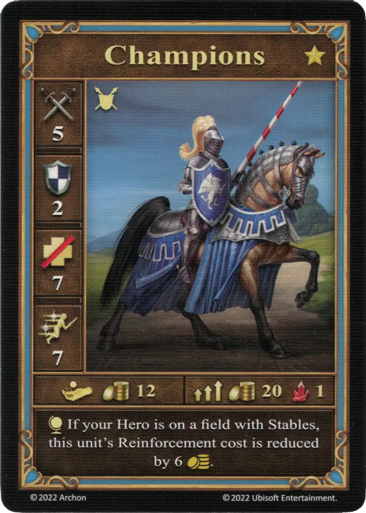

# Champions

=== "Few"

    <figure markdown="span">
        { width="340" align=right }
    </figure>

=== "Pack"

    <figure markdown="span">
        { width="340" align=right }
    </figure>

=== "Neutral"

    <figure markdown="span">
        { width="340" align=right }
    </figure>

| Statistics | Few | Pack | Neutral |
| :--- | :---: | :---: | :---: |
| Town | [Castle](../towns/castle.md) | [Castle](../towns/castle.md) | [Neutral](../towns/neutral.md) |
| Tier | :golden: | :golden: | :golden: |
| Type | [:ground_unit:](index.md#ground-units) | [:ground_unit:](index.md#ground-units) | [:ground_unit:](index.md#ground-units) |
| :attack: | 5 | **6** | 4 |
| :defense: | 2 | 2 | 2 |
| :health_points: | 7 | 7 | 6 |
| :initiative: | 7 | **9** | 8 |
| Cost | 12 :gold: | 20 :gold: 1 :valuables: | 18 :gold: |
| Abilities | :map_effect: If your hero is on a field with Stables, this unit's reinforcement cost is reduced by 6 :gold:. | :unit_attack: If this unit's movement ends in a space other than where it started, you may reroll an [Attack die](../keywords/dice.md#attack-die). | :unit_attack: Roll 2 [Attack dice](../keywords/dice.md#attack-die) and apply both outcomes. :unit_passive: Reroll this unit's all "-1" rolls. |

## Notes

- **Neutral** - A -1 on the Attack die is always rerolled, even multiple times.
- **Neutral** - When attacking neutral [Manticores](manticores.md), the [Manticores](manticores.md) receive +2 :defense:, as both Attack dice will always end up as a 0 or a 1.

## Comes With

- [Core Game](../content/core_game.md)

## See Also

- [List of Units](index.md)
- [List of Towns](../towns/index.md)