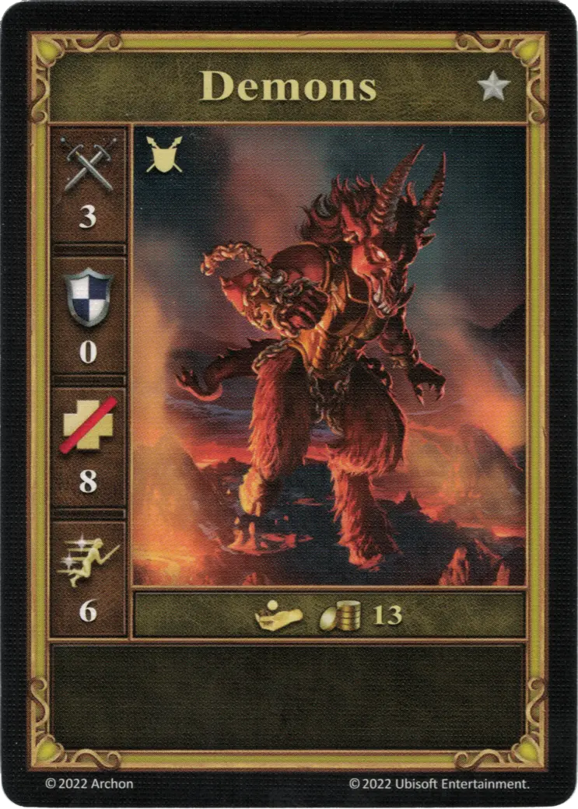

# Demons

=== "Few"

    <figure markdown="span">
        { width="340" align=right }
    </figure>

=== "Pack"

    <figure markdown="span">
        { width="340" align=right }
    </figure>

=== "Neutral"

    <figure markdown="span">
        { width="340" align=right }
    </figure>

| Statistics | Few | Pack | Neutral |
| :--- | :---: | :---: | :---: |
| Town | [Inferno](../towns/inferno.md) | [Inferno](../towns/inferno.md) | [Neutral](../towns/neutral.md) |
| Tier | :silver: | :silver: | :silver: |
| Type | [:ground_unit:](index.md#ground-units) | [:ground_unit:](index.md#ground-units) | [:ground_unit:](index.md#ground-units) |
| :attack: | 3 | 3 | 3 |
| :defense: | 2 | 2 | 0 |
| :health_points: | 4 | **5** | 8 |
| :initiative: | 5 | **6** | 6 |
| Cost | 6 :gold: | 8 :gold: | 13 :gold: |
| Abilities | - | - | - |

## Comes With

- [Inferno Expansion](../content/inferno_expansion.md)

## See Also

- [List of Units](index.md)
- [List of Towns](../towns/index.md)