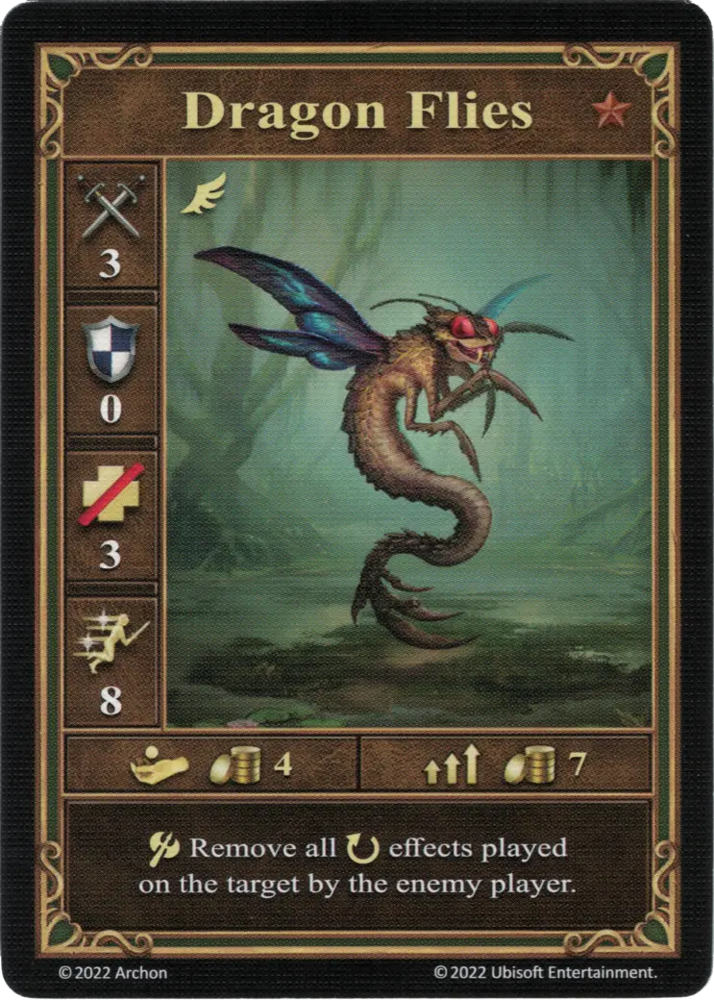
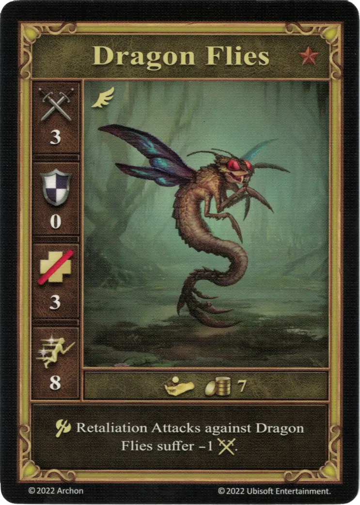
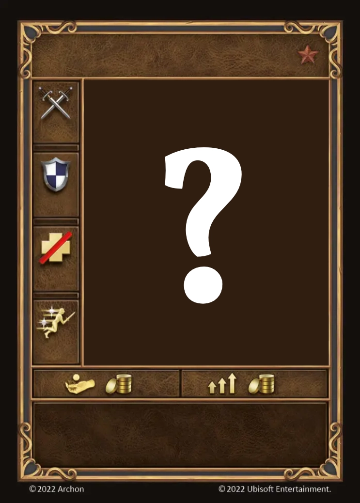

# Dragon Flies

=== "Few"

    <figure markdown="span">
        { width="340" align=right }
    </figure>

=== "Pack"

    <figure markdown="span">
        { width="340" align=right }
    </figure>

=== "Neutral"

    <figure markdown="span">
        { width="340" align=right }
    </figure>

=== "Dragon Fly Hive"

    <figure markdown="span">
        { width="340" align=right }
    </figure>

| Statistics | Few | Pack | Neutral | Dragon Fly Hive |
| :--- | :---: | :---: | :---: | :---: |
| Town | [Fortress](../towns/fortress.md) | [Fortress](../towns/fortress.md) | [Neutral](../towns/neutral.md) | - |
| Tier | :bronze: | :bronze: | :bronze: | - |
| Type | [:flying_unit:](index.md#flying-units) | [:flying_unit:](index.md#flying-units) | [:flying_unit:](index.md#flying-units) | [:flying_unit:](index.md#flying-units) |
| :attack: | 3 | 3 | 3 | 3 |
| :defense: | 0 | **1** | 0 | 0 |
| :health_points: | 3 | 3 | 3 | 2 |
| :initiative: | 8 | **12** | 8 | 8 |
| Cost | 4 :gold: | 7 :gold: | 7 :gold: | - |
| Abilities | :unit_attack: Remove all :ongoing: effects played on the target by the enemy player. | :unit_attack: Remove all :ongoing: effects played on the target by the enemy player. If the target retaliates, it suffers - 1 :attack:. | :unit_attack: Retaliation Attacks against Dragon Flies suffer -1 :attack:. | :unit_attack: Retaliation Attacks against Dragon Flies suffer -2 :attack:. |

## Comes With

- [Fortress Expansion](../content/fortress_expansion.md)
- [Tower Expansion](../content/tower_expansion.md) (Neutral)
- [Naval Battles Expansion](../content/naval_battles_expansion.md) (Crypt and Shipwreck)

## See Also

- [Dragon Fly Hive (Creature Bank)](../fields/dragon_fly_hive_creature_bank.md)
- [List of Units](index.md)
- [List of Towns](../towns/index.md)
