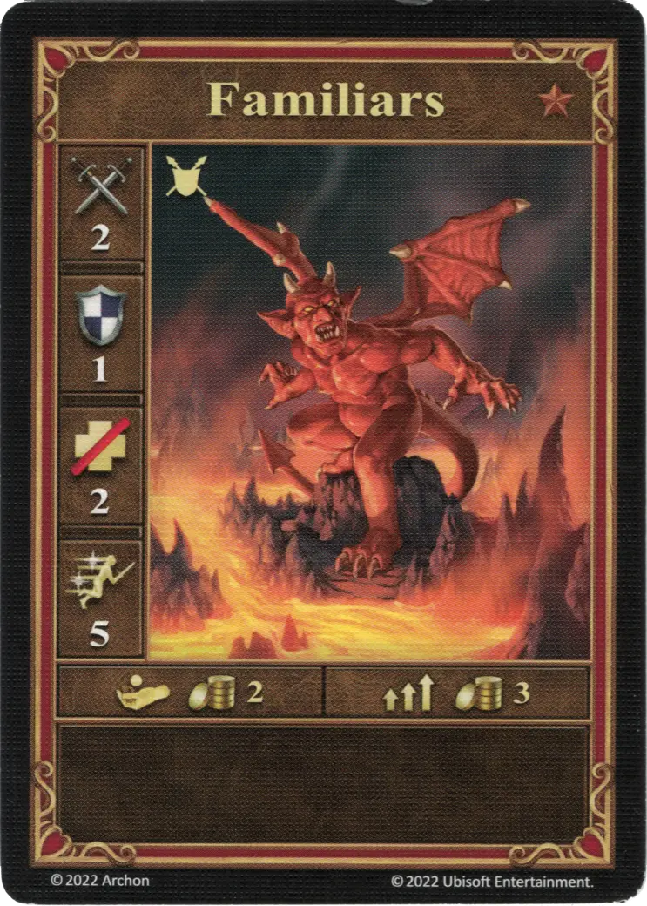
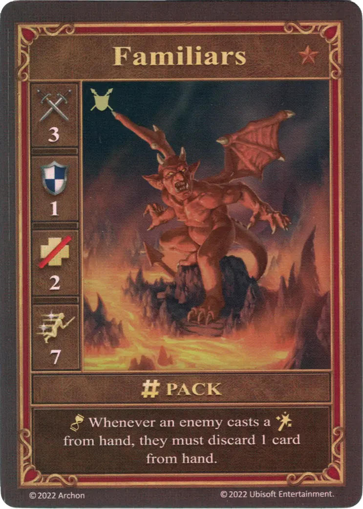

# Familiars

=== "Few"

    <figure markdown="span">
        { width="340" align=right }
    </figure>

=== "Pack"

    <figure markdown="span">
        { width="340" align=right }
    </figure>

=== "Neutral"

    <figure markdown="span">
        { width="340" align=right }
    </figure>

=== "Imp Cache"

    <figure markdown="span">
        { width="340" align=right }
    </figure>

| Statistics | Few | Pack | Neutral | Imp Cache |
| :--- | :---: | :---: | :---: | :---: |
| Town | [Inferno](../towns/inferno.md) | [Inferno](../towns/inferno.md) | [Neutral](../towns/neutral.md) | - |
| Tier | :bronze_tier: | :bronze_tier: | :bronze_tier: | - |
| Type | [:ground_unit:](index.md#ground-units) | [:ground_unit:](index.md#ground-units) | [:ground_unit:](index.md#ground-units) | [:ground_unit:](index.md#ground-units) |
| :attack: | 2 | **3** | 3 | 1 |
| :defense: | 1 | 1 | 1 | 0 |
| :health_points: | 2 | 2 | 2 | 2 |
| :initiative: | 5 | **7** | 7 | 5 |
| Cost | 2 :gold: | 3 :gold: | 6 :gold: | - |
| Abilities | - | :unit_passive: Whenever an enemy casts a [:spell:](../spells/index.md) from hand, they must discard 1 card from hand. | :unit_passive: Whenever an enemy cast a [:spell:](../spells/index.md) from hand, they must discard 1 card from hand. | :unit_passive: As long as this unit is Stacked, whenever the enemy casts a spell, reduce their :power: by 1 (to a minimum of 0).

## Notes

- **Pack and Neutral** - As long as Familiars are in play, the enemy player can only cast a [spell](../spells/index.md) if they can discard a card (the discard is treated as a cost of playing the spell). If they have no card to discard, they can not play any [spells](../spells/index.md).

## Comes With

- [Inferno Expansion](../content/inferno_expansion.md)
- [Naval Battles Expansion](../content/naval_battles_expansion.md) (Imp Cache)

## See Also

- [Imp Cache (Creature Bank)](../fields/imp_cache_creature_bank.md)
- [List of Units](index.md)
- [List of Towns](../towns/index.md)
