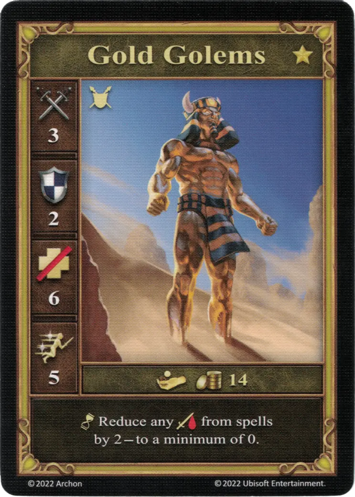

# Gold Golems

=== "Neutral"

    <figure markdown="span">
        { width="340" align=right }
    </figure>

=== "Pyramid"

    <figure markdown="span">
        { width="340" align=right }
    </figure>

| Statistics | Neutral | Pyramid |
| :--- | :---: | :---: |
| Town | [Neutral](../towns/neutral.md) | - |
| Tier | :golden: | - |
| Type | [:unit_ground:](index.md#ground-units) | [:unit_ground:](index.md#ground-units) |
| :attack: | 3 | 3 |
| :defense: | 2 | 1 |
| :health_points: | 6 | 4 |
| :initiative: | 5 | 4 |
| Cost | 14 :gold: | - |
| Abilities | :unit_passive: Reduce any :damage: from [spells](../spells/index.md) by 2 — to a minimum of 0. | :unit_passive: This unit reduces any :damage: it takes from [spells](../spells/index.md) by 2 — to a minimum of 0. |

## Comes With

- [Core Game](../content/core_game.md)
- [Naval Battles Expansion](../content/naval_battles_expansion.md) (Pyramid)

## See Also

- [Pyramid (Creature Bank)](../fields/pyramid_creature_bank.md)
- [List of Units](index.md)
- [List of Towns](../towns/index.md)
