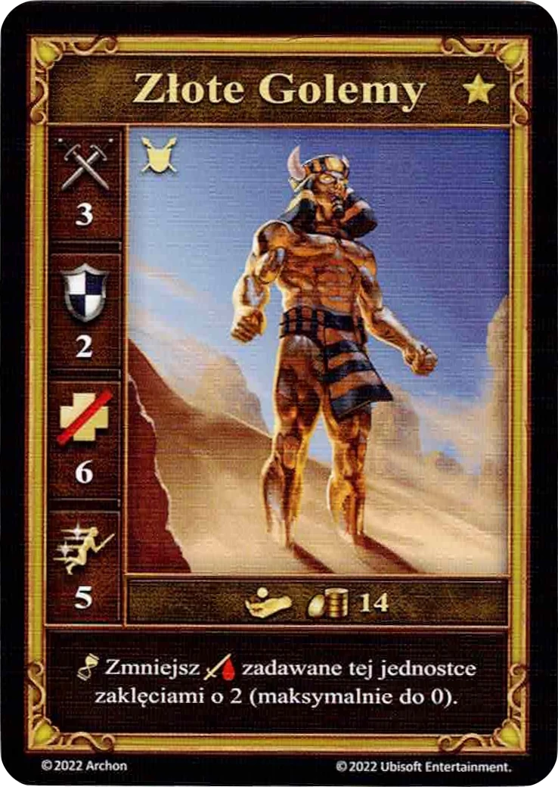

# Złote Golemy

<figure markdown="span">
    { width="340" align=right }
</figure>

| Statystyki | Neutralne |
| :--- | :---: |
| Miasto | [Neutralne](../towns/neutral.md) |
| Poziom | :golden: |
| Typ | [:unit_ground:](../keywords/ground_unit.md) |
| :attack: | 3 |
| :defense: | 2 |
| :health_points: | 6 |
| :initiative: | 5 |
| Koszt | 14 :gold: |
| Zdolność | :unit_passive: Zmniejsz :damage: zadawane tej jednostce [zaklęciami](../spells/index.md) o 2 (maksymalnie do 0). |

## Pochodzi z

- [Pudełko Podstawowe](../content/core_game.md)

## Zobacz też

- [Lista Jednostek](index.md)
- [Lista Miast](../towns/index.md)
