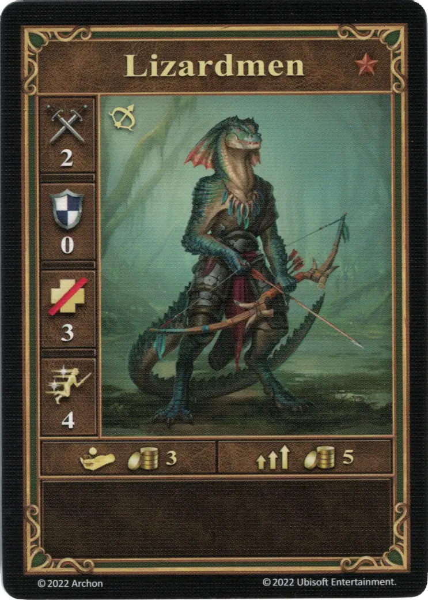

# Lizardmen

=== "Few"

    <figure markdown="span">
        { width="340" align=right }
    </figure>

=== "Pack"

    <figure markdown="span">
        { width="340" align=right }
    </figure>

=== "Neutral"

    <figure markdown="span">
        { width="340" align=right }
    </figure>

| Statistics | Few | Pack | Neutral |
| :--- | :---: | :---: | :---: |
| Town | [Fortress](../towns/fortress.md) | [Fortress](../towns/fortress.md) | [Neutral](../towns/neutral.md) |
| Tier | :bronze_tier: | :bronze_tier: | :bronze_tier: |
| Type | [:ranged_unit:](index.md#ranged-units) | [:ranged_unit:](index.md#ranged-units) | [:ranged_unit:](index.md#ranged-units) |
| :attack: | 2 | **3** | 2 |
| :defense: | 0 | 0 | 0 |
| :health_points: | 3 | 3 | 4 |
| :initiative: | 4 | **5** | 5 |
| Cost | 3 :gold: | 5 :gold: | 4 :gold: |
| Abilities | - | - | - |

## Heroes With A Specialty

- [:might: Wystan](../heroes/wystan.md#specialty)

## Comes With

- [Fortress Expansion](../content/fortress_expansion.md)
- [Tower Expansion](../content/tower_expansion.md) (Neutral)

## See Also

- [List of Units](index.md)
- [List of Towns](../towns/index.md)