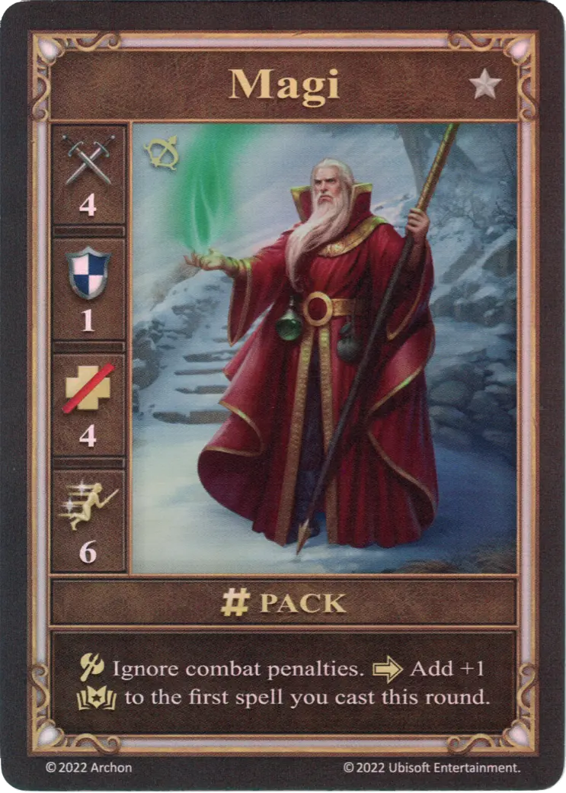

# Magi

=== "Few"

    <figure markdown="span">
        { width="340" align=right }
    </figure>

=== "Pack"

    <figure markdown="span">
        { width="340" align=right }
    </figure>

=== "Neutral"

    <figure markdown="span">
        { width="340" align=right }
    </figure>

| Statistics | Few | Pack | Neutral |
| :--- | :---: | :---: | :---: |
| Town | [Tower](../towns/tower.md) | [Tower](../towns/tower.md) | [Neutral](../towns/neutral.md) |
| Tier | :silver: | :silver: | :silver: |
| Type | [:unit_ranged:](../keywords/ranged_unit.md) | [:unit_ranged:](../keywords/ranged_unit.md) | [:unit_ranged:](../keywords/ranged_unit.md) |
| :attack: | 3 | **4** | 3 |
| :defense: | 0 | **1** | 0 |
| :health_points: | 4 | 4 | 5 |
| :initiative: | 5 | 6 | 6 |
| Cost | 6 :gold: | 11 :gold: | 11 :gold: |
| Abilities | :unit_attack: Ignore combat penalties. | :unit_attack: Ignore combat penalties. :activation: Add +1 :empower: to the first [spell](../spells/index.md) you cast this round. | :unit_attack: Ignore combat penalties. After this unit's attack, the enemy discards a random card or a card with :empower:. |

## Heroes With A Specialty

- [:magic: Dracon](../heroes/dracon.md#specialty)

## Notes

- **Pack** - A [spell](../spells/index.md) will only receive the +1 :empower: by the Magi, if it's the player's first [spell](../spells/index.md) of the current Combat round and it was played either during the activation of Magi or later.
- **Neutral** - Should a random card be discarded, the card can not be chosen. In a multiplayer game, another player picks the random card.

## Comes With

- [Tower Expansion](../content/tower_expansion.md)

## See Also

- [List of Units](index.md)
- [List of Towns](../towns/index.md)