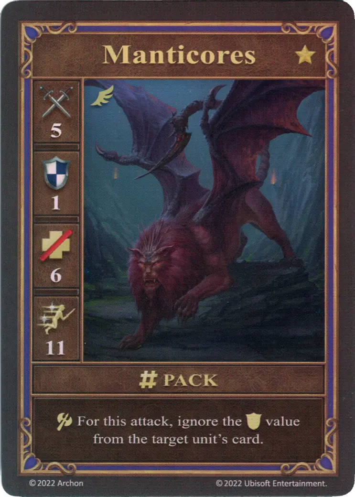
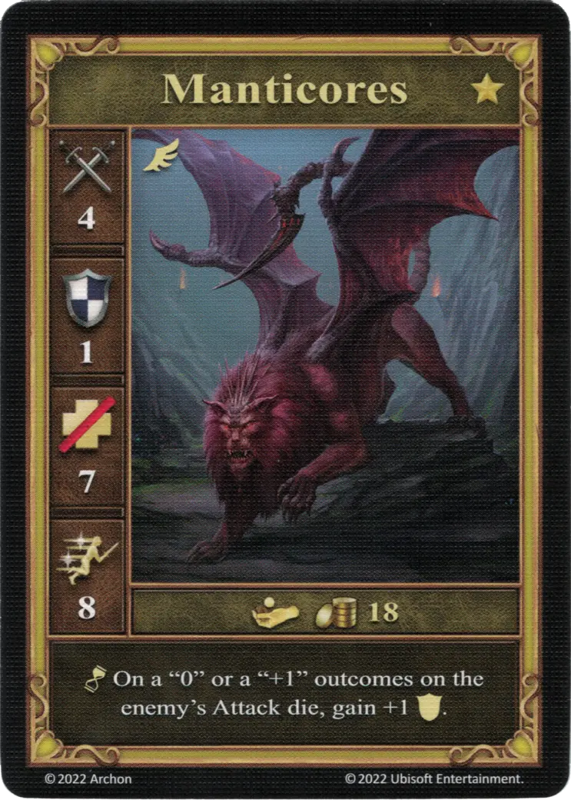

# Manticores

=== "Few"

    <figure markdown="span">
        { width="340" align=right }
    </figure>

=== "Pack"

    <figure markdown="span">
        { width="340" align=right }
    </figure>

=== "Few (Alternate)"

    <figure markdown="span">
        { width="340" align=right }
    </figure>

=== "Pack (Alternate)"

    <figure markdown="span">
        { width="340" align=right }
    </figure>

=== "Neutral"

    <figure markdown="span">
        { width="340" align=right }
    </figure>

| Statistics | Few | Pack | Few (Alternate) | Pack (Alternate) | Neutral |
| :--- | :---: | :---: | :---: | :---: | :---: |
| Town | [Dungeon](../towns/dungeon.md) | [Dungeon](../towns/dungeon.md) | [Dungeon](../towns/dungeon.md) | [Dungeon](../towns/dungeon.md) | [Neutral](../towns/neutral.md) |
| Tier | :golden: | :golden: | :golden: | :golden: | :golden: |
| Type | [:flying_unit:](index.md#flying-units) | [:flying_unit:](index.md#flying-units) | [:flying_unit:](index.md#flying-units) | [:flying_unit:](index.md#flying-units) | [:flying_unit:](index.md#flying-units) |
| :attack: | 5 | 5 | 4 |  4 | 4 |
| :defense: | 1 | 1 | 1 |  **2** | 1 |
| :health_points: | 6 | 6 | 7 |  7 | 7 |
| :initiative: | 7 | **11** | 8 | **11** | 8 |
| Cost | 10 :gold: | 18 :gold: 1 :valuables: | 12 :gold: | 18 :gold: 1 :valuables: | 18 :gold: |
| Abilities | - | :unit_attack: For this attack, ignore the :defense: value from the target unit's card. | :unit_attack: Place 1 faction cube on the target. When it activates, remove the cube to inflict 1 :damage:. | :unit_passive: After each attack, place 1 faction cube on the target. When it activates, remove the cube to inflict 1 :damage:. | :unit_passive: On a "0" or a "+1" outcomes on the enemy's [Attack die](../keywords/dice.md#attack-die), gain +1 :defense:. |

## Notes

- **Pack** - Only the :defense: value printed on the target unit's card is ignored, bonuses provided by other cards are still valid.
- **Neutral** - When attacked by neutral [Champions](champions.md), the Manticores receive +2 :defense:, as both Attack dice will always end up as a 0 or a 1.

## Comes With

- [Core Game](../content/core_game.md)
- [Regular Stretch Goals 2024](../content/regular_stretch_goals.md) - Alternate version

## See Also

- [List of Units](index.md)
- [List of Towns](../towns/index.md)
