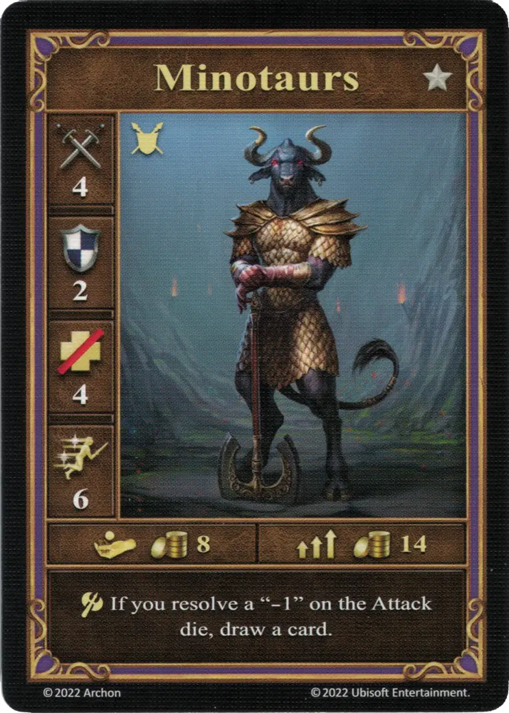

# Minotaurs

=== "Few"

    <figure markdown="span">
        { width="340" align=right }
    </figure>

=== "Pack"

    <figure markdown="span">
        { width="340" align=right }
    </figure>

=== "Neutral"

    <figure markdown="span">
        { width="340" align=right }
    </figure>

| Statistics | Few | Pack | Neutral |
| :--- | :---: | :---: | :---: |
| Town | [Dungeon](../towns/dungeon.md) | [Dungeon](../towns/dungeon.md) | [Neutral](../towns/neutral.md) |
| Tier | :silver: | :silver: | :silver: |
| Type | [:unit_ground:](index.md#ground-units) | [:unit_ground:](index.md#ground-units) | [:unit_ground:](index.md#ground-units) |
| :attack: | 4 | **5** | 3 |
| :defense: | 2 | 2 | 2 |
| :health_points: | 4 | 4 | 4 |
| :initiative: | 6 | **8** | 7 |
| Cost | 8 :gold: | 14 :gold: | 11 :gold: |
| Abilities | :unit_attack: If you resolve a "-1" on the [Attack die](../keywords/dice.md#attack-die), draw a card, | :unit_attack: If you resolve a "-1" on the [Attack die](../keywords/dice.md#attack-die), draw a card, | :unit_attack: Reroll this unit's "-1" outcome on the [Attack die](../keywords/dice.md#attack-die). |

## Comes With

- [Core Game](../content/core_game.md)

## See Also

- [List of Units](index.md)
- [List of Towns](../towns/index.md)