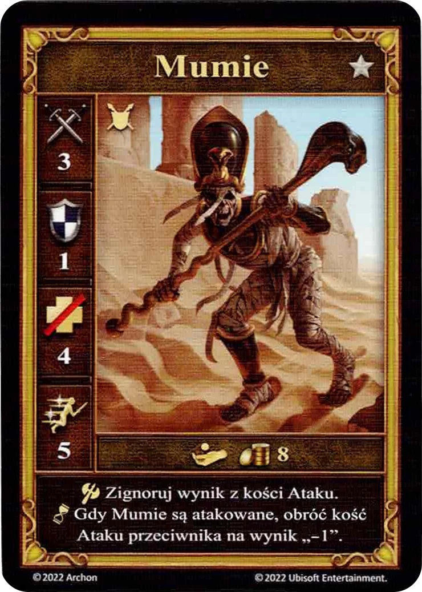

# Mumie

<figure markdown="span">
    { width="340" align=right }
</figure>

| Statystyki | Neutralne |
| :--- | :---: |
| Miasto | [Neutralne](../towns/neutral.md) |
| Poziom | :silver: |
| Typ | [:unit_ground:](../keywords/ground_unit.md) |
| :attack: | 3 |
| :defense: | 1 |
| :health_points: | 4 |
| :initiative: | 5 |
| Koszt | 8 :gold: |
| Zdolności | :unit_attack: Zignoruj wynik z  [kości Ataku](../dice.md#attack-die). :unit_passive: Gdy Mumie są atakowane, obróć [kość Ataku](../dice.md#attack-die) przeciwnika na wynik „-1”. |

## Uwagi

- Gracz nadal rzuca kością Ataku, ponieważ inne efekty związane z jej wynikiem mogą mieć zastosowanie.
- Atak na Mumie ustawia tylko pierwotną kość Ataku na „-1”. Po rzucie może ona być zmodyfikowana przez efekty pozwalające na przerzucenia.

## Pochodzi z

- [Pudełko Podstawowe](../content/core_game.md)

## Zobacz też

- [Lista Jednostek](index.md)
- [Lista Miast](../towns/index.md)
