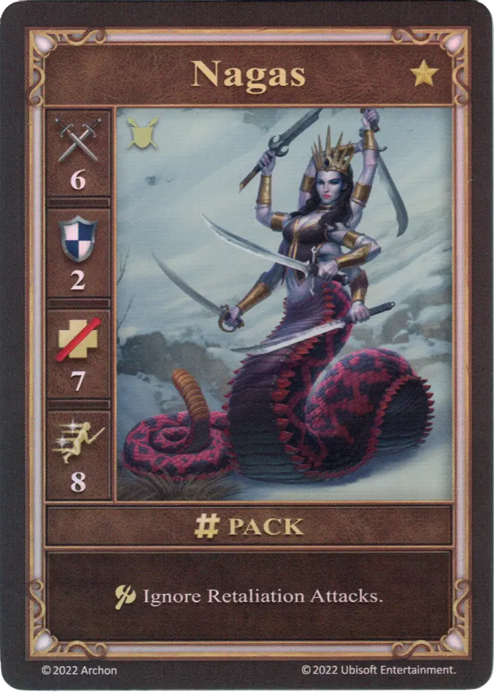

# Nagas

=== "Few"

    <figure markdown="span">
        { width="340" align=right }
    </figure>

=== "Pack"

    <figure markdown="span">
        { width="340" align=right }
    </figure>

=== "Neutral"

    <figure markdown="span">
        { width="340" align=right }
    </figure>

| Statistics | Few | Pack | Neutral |
| :--- | :---: | :---: | :---: |
| Town | [Tower](../towns/tower.md) | [Tower](../towns/tower.md) | [Neutral](../towns/neutral.md) |
| Tier | :golden: | :golden: | :golden: |
| Type | :unit_ground: | :unit_ground: |
| :attack: | 5 | **6** |
| :defense: | 2 | 2 |
| :health_points: | 7 | 7 |
| :initiative: | 6 | **8** |
| Cost | 13 :gold: | 18 :gold: 1 :valuables: |
| Abilities | :unit_attack: Ignore Retaliation Attacks. | :unit_attack: Ignore Retaliation Attacks. |

## Comes With

- [Tower Expansion](../content/tower_expansion.md)

## See Also

- [List of Units](index.md)
- [List of Towns](../towns/index.md)