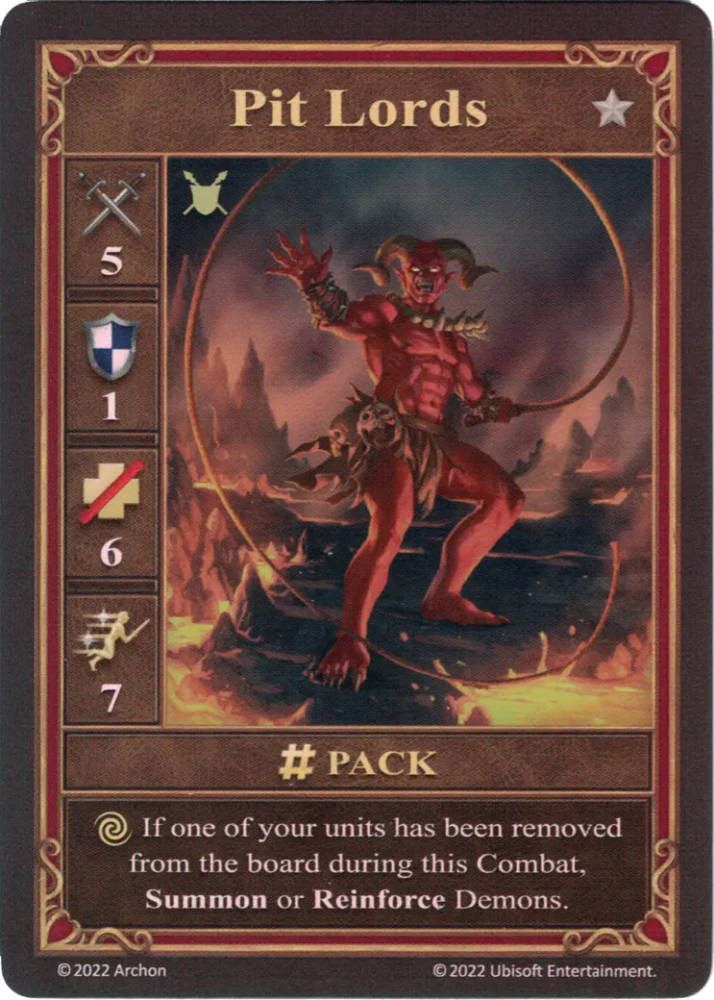

# Pit Lords

=== "Few"

    <figure markdown="span">
        { width="340" align=right }
    </figure>

=== "Pack"

    <figure markdown="span">
        { width="340" align=right }
    </figure>

=== "Neutral"

    <figure markdown="span">
        { width="340" align=right }
    </figure>

| Statistics | Few | Pack | Neutral |
| :--- | :---: | :---: | :---: |
| Town | [Inferno](../towns/inferno.md) | [Inferno](../towns/inferno.md) | [Neutral](../towns/neutral.md) |
| Tier | :silver_tier: | :silver_tier: | :silver_tier: |
| Type | [:ground_unit:](index.md#ground-units) | [:ground_unit:](index.md#ground-units) | [:ground_unit:](index.md#ground-units) |
| :attack: | 4 | **5** | 4 |
| :defense: | 1 | 1 | 1 |
| :health_points: | 6 | 6 | 5 |
| :initiative: | 6 | **7** | 7 |
| Cost | 8 :gold: | 15 :gold: | 15 :gold: |
| Abilities | - | :unit_other: If one of your units has been removed from the board during this Combat, Summon or Reinforce [Demons](demons.md). | - |

## Notes

- **Pack** - Should the Pit Lords use their [alternative action](../keywords/alternative_action.md), they are not allowed to move, attack or defend.
- **Pack** - Should the Pit Lords summon [Few Demons](demons.md), they have to be placed adjacent to the Pit Lords.
- **Pack** - Should the Pit Lords reinforce [Few Demons](demons.md) to a [Pack of Demons](demons.md), there is no recruitment cost to be paid.
- **Pack** - The summoned [Demons](demons.md) will activate during the Combat round when they were summoned, as long as their initiative is lower or equal to the initiative of the Pit Lords. If the initiative is higher, they are treated as if they were already activated during this Combat round.
- **Pack** - The summoned or reinforced [Demons](demons.md) stay in the player's army after the end of the Combat.
- **Pack** - The Pit Lords may only summon or reinforce [Demons](demons.md) once per Combat.

## Comes With

- [Inferno Expansion](../content/inferno_expansion.md)

## See Also

- [List of Units](index.md)
- [List of Towns](../towns/index.md)