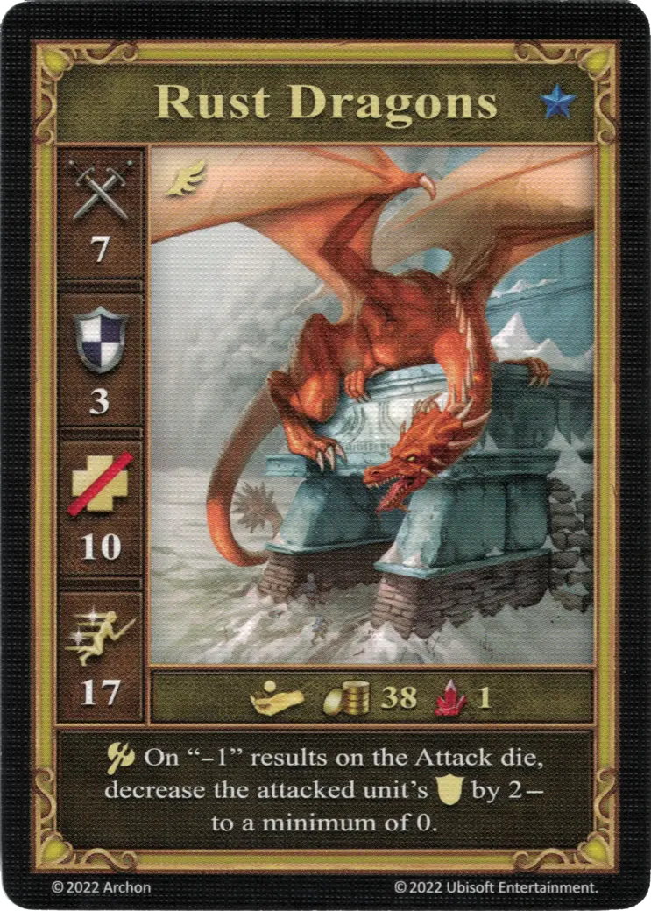

# Rust Dragons

<figure markdown="span">
    { width="340" align=right }
</figure>

| Statistics | Neutral |
| :--- | :---: |
| Town | [Neutral](../towns/neutral.md) |
| Tier | :azure_tier: |
| Type | [:flying_unit:](index.md#flying-units) |
| :attack: | 7 |
| :defense: | 3 |
| :health_points: | 10 |
| :initiative: | 17 |
| Cost | 38 :gold: 1 :valuables: |
| Abilities | :unit_attack: On "-1" results on the [Attack die](../keywords/dice.md#attack-die), decrease the attacked unit's :defense: by 2 - to a minimum of 0. |

## Heroes With A Specialty

- [:might: Mutare](../heroes/mutare.md#specialty)

## Comes With

- [Fortress Expansion](../content/fortress_expansion.md)

## See Also

- [List of Units](index.md)
- [List of Towns](../towns/index.md)