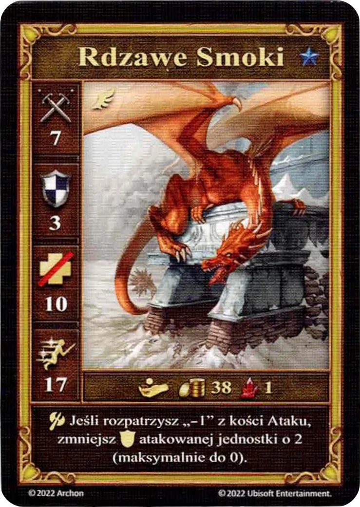

# Rdzawe Smoki

<figure markdown="span">
    { width="340" align=right }
</figure>

| Statystyki | Neutralne |
| :--- | :---: |
| Miasto | [Neutralne](../towns/neutral.md) |
| Poziom | :azure: |
| Typ | [:unit_flying:](../keywords/flying_unit.md) |
| :attack: | 7 |
| :defense: | 3 |
| :health_points: | 10 |
| :initiative: | 17 |
| Koszt | 38 :gold: 1 :valuables: |
| Zdolności | :unit_attack: Jeśli rozpatrzysz „-1” z [kości Ataku](../dice.md#attack-die), zmniejsz :defense: atakowanej jednostki o 2 (maksymalnie do 0). |

## Bohaterowie ze Specjalnością

- [:might: Mutare](../heroes/mutare.md#specialty)

## Pochodzi z

- [Rozszerzenie Cytadela](../content/fortress_expansion.md)

## Zobacz też

- [Lista Jednostek](index.md)
- [Lista Miast](../towns/index.md)
