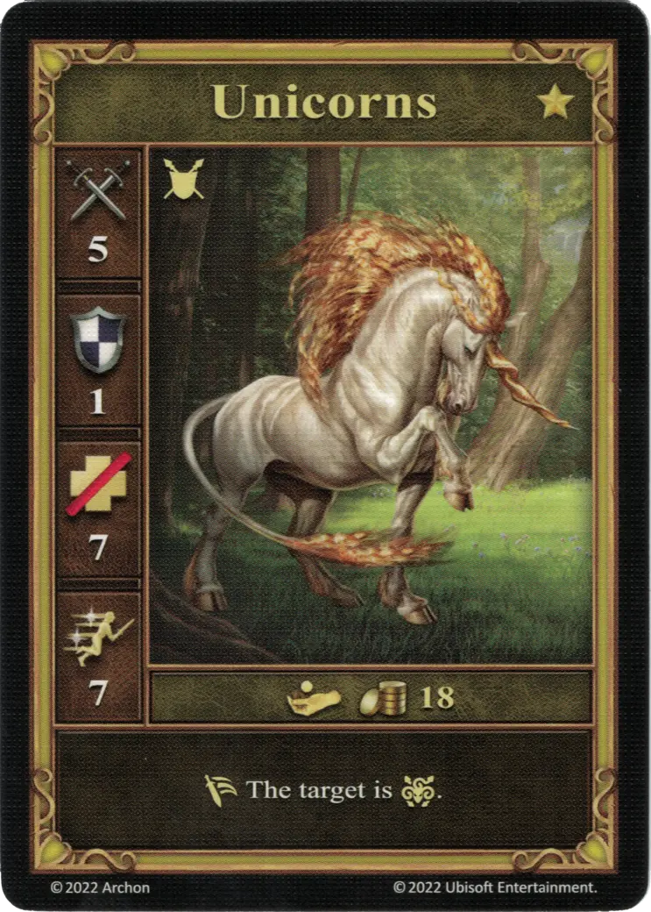

# Unicorns

=== "Few"

    <figure markdown="span">
        { width="340" align=right }
    </figure>

=== "Pack"

    <figure markdown="span">
        { width="340" align=right }
    </figure>

=== "Neutral"

    <figure markdown="span">
        { width="340" align=right }
    </figure>

| Statistics | Few | Pack | Neutral |
| :--- | :---: | :---: | :---: |
| Town | [Rampart](../towns/rampart.md) | [Rampart](../towns/rampart.md) | [Neutral](../towns/neutral.md) |
| Tier | :golden: | :golden: | :golden: |
| Type | [:ground_unit:](index.md#ground-units) | [:ground_unit:](index.md#ground-units) | [:ground_unit:](index.md#ground-units) |
| :attack: | 5 | **6** | 5 |
| :defense: | 1 | 1 | 1 |
| :health_points: | 8 | 8 | 7 |
| :initiative: | 7 | **9** | 7 |
| Cost | 11 :gold: | 18 :gold: 1 :valuables: | 18 :gold: |
| Abilities | :unit_passive: Reduce any :damage: from [:spell:](../spells/index.md) dealt to this unit by 1 (to a minimum of 0), | :unit_passive: Reduce any :damage: from [:spell:](../spells/index.md) dealt to this and adjacent friendly unit(s) by 1 (to a minimum of 0), | :unit_retaliation: The target is :paralysis:. |

## Heroes With A Specialty

- [:might: Clancy](../heroes/clancy.md#specialty)

## Notes

- **Neutral** - See [Paralysis](../keywords/paralysis.md)

## Comes With

- [Rampart Expansion](../content/rampart_expansion.md)
- [Tower Expansion](../content/tower_expansion.md) (Neutral)

## See Also

- [List of Units](index.md)
- [List of Towns](../towns/index.md)