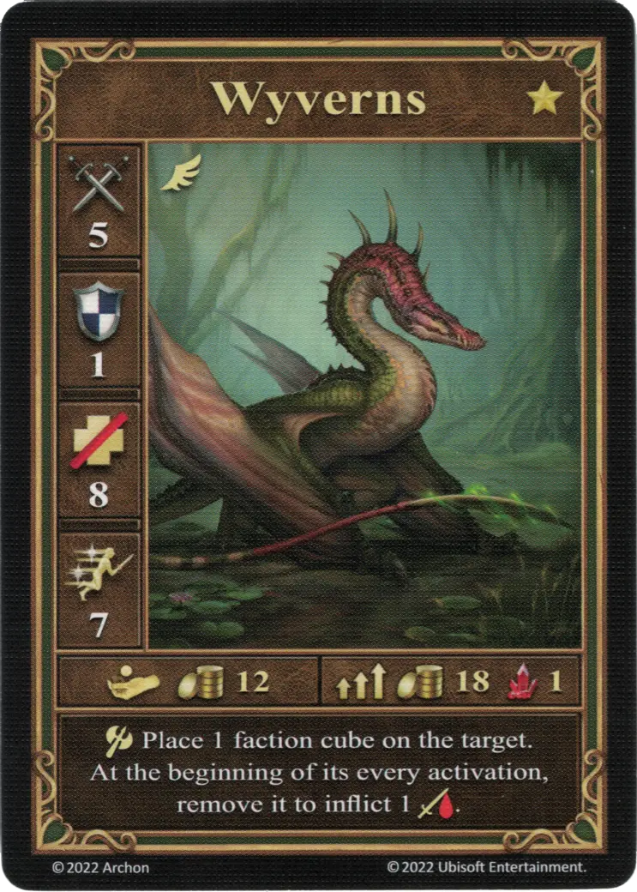

# Wyverns

=== "Few"

    <figure markdown="span">
        { width="340" align=right }
    </figure>

=== "Pack"

    <figure markdown="span">
        { width="340" align=right }
    </figure>

=== "Neutral"

    <figure markdown="span">
        { width="340" align=right }
    </figure>

| Statistics | Few | Pack | Neutral |
| :--- | :---: | :---: | :---: |
| Town | [Fortress](../towns/fortress.md) | [Fortress](../towns/fortress.md) | [Neutral](../towns/neutral.md) |
| Tier | :gold_tier: | :gold_tier: | :gold_tier: |
| Type | [:flying_unit:](index.md#flying-units) | [:flying_unit:](index.md#flying-units) | [:flying_unit:](index.md#flying-units) |
| :attack: | 5 | **6** | 4 |
| :defense: | 1 | 1 | 1 |
| :health_points: | 8 | 8 | 7 |
| :initiative: | 7 | **11** | 8 |
| Cost | 12 :gold: | 18 :gold: 1 :valuables: | 17 :gold: |
| Abilities | :unit_attack: Place 1 faction cube on the target. At the beginning of its every activation, remove it to inflict 1 :damage:. | :unit_attack: Place 2 faction cubes on the target. At the beginning of its every activation, remove 1 of them to inflict 1 :damage:. | :unit_attack: After the attack, roll 1 [Attack die](../keywords/dice.md#attack-die). On a "0" result, deal 1 :damage: to the target unit. |

## Notes

- **Few and Pack** - Enemy units, that were attacked by the Wyverns, receive damage on each activation, as long as there is at least one faction cube on them.
- **Few and Pack** - If [Trolls](trolls.md) or [Wraiths](wraiths.md) were attacked by the Wyverns, both the damage and the healing take place simultaneously. This means [Trolls](trolls.md) only remove up to 2 :damage:. Nothing happens for faction (Few and Pack) [Wraiths](wraiths.md), and their Neutral variant removes up to 1 :damage:.

## Comes With

- [Fortress Expansion](../content/fortress_expansion.md)
- [Tower Expansion](../content/tower_expansion.md) (Neutral)

## See Also

- [List of Units](index.md)
- [List of Towns](../towns/index.md)