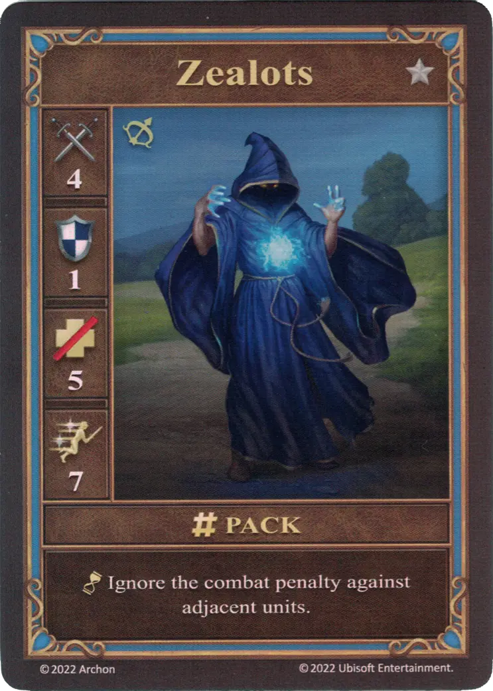

# Zealots

=== "Few"

    <figure markdown="span">
        { width="340" align=right }
    </figure>

=== "Pack"

    <figure markdown="span">
        { width="340" align=right }
    </figure>

=== "Neutral"

    <figure markdown="span">
        { width="340" align=right }
    </figure>

| Statistics | Few | Pack | Neutral |
| :--- | :---: | :---: | :---: |
| Town | [Castle](../towns/castle.md) | [Castle](../towns/castle.md) | [Neutral](../towns/neutral.md) |
| Tier | :silver: | :silver: | :silver: |
| Type | [:unit_ranged:](index.md#ranged-units) | [:unit_ranged:](index.md#ranged-units) | [:unit_ranged:](index.md#ranged-units) |
| :attack: | 3 | **4** | 3 |
| :defense: | 1 | 1 | 0 |
| :health_points: | 5 | 5 | 5 |
| :initiative: | 5 | **7** | 5 |
| Cost | 8 :gold: | 12 :gold: | 12 :gold: |
| Abilities | - | :unit_passive: Ignore the combat penalty against adjacent units. | :unit_passive: Ignore the combat penalty against adjacent units. |

## Comes With

- [Core Game](../content/core_game.md)

## See Also

- [List of Units](index.md)
- [List of Towns](../towns/index.md)