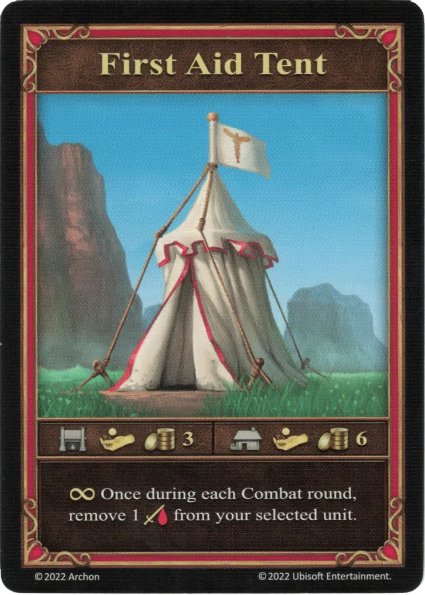

# First Aid Tent

{ width="340" align=right }

___

[Machina Wojenna](index.md)

___

:permanent: Once during each Combat round, remove 1 :damage: from your selected unit.

___

:pay: 3 :gold: at Blacksmith  — OR —  :pay: 6 :gold: at Trade Post

## Uwagi

- The effect may be used at any point during the Combat round (similar to an :instant: effect).
- :damage: can only be removed *after* it was dealt. The First Aid Tent can not prevent defeat of a unit by reducing the incoming :damage:.

## Pochodzi z

- [Rozszerzenie Bastion](../content/rampart_expansion.md)

## Zobacz też

- [List of War Machines](index.md)
